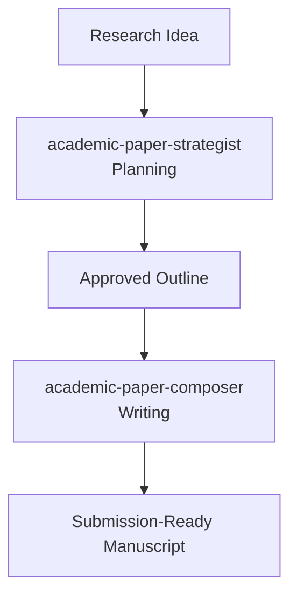

# Academic Paper Composer

Systematic framework for writing complete academic manuscripts from approved outlines. Part 2 of the two-skill end-to-end academic paper workflow.

## Two-Skill End-to-End Workflow



This skill handles **Phase 2: Writing**. Use `academic-paper-strategist` for Phase 1: Planning.

## When to Use This Skill

- You have an approved outline from `academic-paper-strategist` and want to write the full paper
- You need systematic chapter-by-chapter writing with quality checks
- You want final polishing and submission preparation
- You are transforming a PhD dissertation chapter into a journal article
- You need to prepare a manuscript for preprint submission

## Three-Phase Writing Process

### Phase 1: Foundation Setup
**Goal:** Load style guide and plan chapter writing sequence

**Steps:**
1. Load style guide from planning phase
2. Load final outline from planning phase
3. Confirm writing order (usually introduction → literature → methodology → results → discussion → conclusion)
4. Set up directory structure
5. Verify all requirements understood

**Deliverable:** `WRITING_PLAN.md` - Chapter-by-chapter writing plan

### Phase 2: Systematic Writing
**Goal:** Write full manuscript with per-chapter quality checks

**Process:**
- Write **one chapter at a time**
- After each chapter, run automated quality check
- Fix issues before proceeding to next chapter
- Maintain consistent style throughout

**Quality checks per chapter:**
1. **Argument coherence**: Does the argument flow logically?
2. **Citation completeness**: Are all claims cited?
3. **Style consistency**: Does it match venue style guide?
4. **Length appropriateness**: Is chapter within expected length?
5. **Figure/table planning**: Are all visuals properly planned?

### Phase 3: Final Polishing
**Goal:** Complete evaluation and submission preparation

**Steps:**
1. Full manuscript assessment using 7-dimension system
2. Check cross-reference consistency
3. Verify citation format throughout
4. Proofread for clarity and flow
5. Prepare submission files (manuscript, cover letter, response to reviewers template)
6. Generate preprint metadata for submission platforms

**Deliverables:**
- Full manuscript in Markdown (`MANUSCRIPT.md`)
- Cover letter template (`COVER_LETTER.md`)
- Final evaluation report (`EVALUATION.md`)

## Section-by-Section Guidance

### Introduction
- Hook the reader: Why is this problem important?
- Context: What do we already know?
- Gap: What question are we answering?
- Thesis: What is your main claim?
- Roadmap: How does the paper proceed?

### Literature Review
- Synthesize, don't summarize
- Organize by theme, not by author
- Identify debates and contradictions
- Show how your work fits into the larger picture
- Identify the gap your work fills

### Methodology
- Enough detail for replication
- Justify your choices: Why this method over alternatives?
- Describe analyses: How do you test your hypothesis?
- Include validation steps: How do you know results are reliable?

### Results
- Present findings logically
- Use visuals effectively (figures, tables)
- Report all relevant results (including null/negative results)
- Separate results from discussion

### Discussion
- Interpret your results: What do findings mean?
- Connect back to literature: How does your work relate to existing research?
- Acknowledge limitations: What are the weaknesses of your study?
- State implications: Why do these findings matter?
- Future work: What questions remain?

### Conclusion
- Brief summary of main findings
- Broader significance
- Final takeaway message

## Quality Standards

### Writing Principles
- **Clarity first**: Write for understanding, not for impressing
- **Precise language**: Avoid vague terms and jargon when unnecessary
- **Logical flow**: Each paragraph should build on the previous one
- **Hedging appropriately**: Acknowledge uncertainty where it exists
- **Proper citation**: Credit all relevant previous work

### Structure Requirements
- Standard sections: Introduction → Lit Review → Methodology → Results → Discussion → Conclusion
- Clear subsection hierarchy
- Numbered equations, figures, and tables
- Cross-references where appropriate
- Consistent citation style throughout

## Validation Gates

### After Each Chapter
- Chapter-level quality check completed
- All issues identified in check addressed
- Style consistent with guide
- Length within expected range

### Before Completion
- All chapters written
- Full 7-dimension assessment completed
- Score ≥ 28/35 overall
- All major issues addressed
- Manuscript coherent as a whole

## Output Formats

- **Main manuscript**: Markdown format with proper section headings
- **Cover letter**: Journal submission cover letter template
- **Preprint metadata**: Title, abstract, keywords for preprint platforms
- **Supplementary materials**: Separate file for supplementary info

## Supported Preprint Platforms

After writing complete, you get prepared metadata for:

- **arXiv** - General physics/math/computer science
- **PhilArchive** - Philosophy
- **PhilSci-Archive** - Philosophy of science
- **PsyArXiv** - Psychology
- **bioRxiv** - Biology
- **medRxiv** - Medicine
- **ResearchSquare** - Multidisciplinary

## Starting Point

To use this skill:

```
Write the paper from this outline: [paste your outline from academic-paper-strategist]
```

The skill will:
1. Set up foundation
2. Write chapter by chapter with quality checks
3. Deliver complete submission-ready manuscript

## Prerequisites

- You must have completed planning with `academic-paper-strategist`
- You must have an approved final outline
- You must have a style guide from the planning phase
- Python 3.8+ for quality verification scripts (optional)
