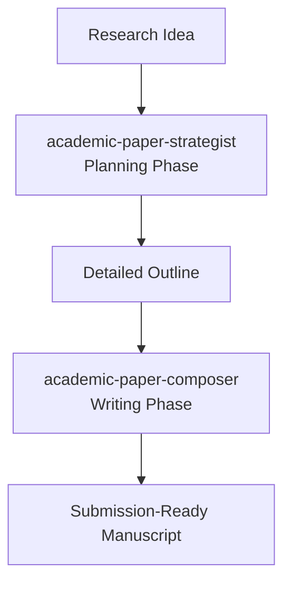

# Academic Paper Strategist

A systematic framework for planning academic papers using structured workflow with quality checkpoints. Transforms research ideas into detailed, reviewer-ready outlines.

## Two-Skill End-to-End Workflow



This skill handles **Phase 1: Planning**. Use `academic-paper-composer` for Phase 2: Writing.

## When to Use This Skill

- You have a research idea and want to plan a complete academic paper
- You need to identify research gaps backed by literature
- You want to optimize your outline before writing
- You are preparing a manuscript for journal submission
- You are a PhD student transforming dissertation chapters into papers

## Three-Phase Planning Process

### Phase 1: Platform Analysis
**Goal:** Identify target venue and extract style guidelines

**Steps:**
1. Define research topic and core contribution
2. Identify target journal/venue
3. Analyze 8-10 sample papers from the venue
4. Extract writing standards, structure patterns, citation styles
5. Create venue-specific style guide

**Deliverable:** `STYLE_GUIDE.md` - Platform-specific writing standards

### Phase 2: Theoretical Framework & Literature Gap Analysis
**Goal:** Identify research gap and establish theoretical framework

**Steps:**
1. Literature search and synthesis
2. Identify 3-5 key papers that motivate your work
3. Systematic gap identification:
   - What does the field currently know?
   - What is missing in current research?
   - What question remains unanswered?
   - Why does this gap matter?
4. Every gap must be backed by 3-5 citations
5. Articulate your core research question and hypothesis

**Deliverable:** `GAP_ANALYSIS.md` - Evidence-based gap identification

### Phase 3: Outline Optimization
**Goal:** Create detailed, reviewer-assessed outline

**Steps:**
1. Generate full paper outline with section-by-section content
2. Run reviewer simulation assessment (7 dimensions, 35 points)
3. Optimize based on assessment feedback
4. Final approval waiting for user

**Quality Threshold:** Outline must score ≥ **28/35** to proceed to writing

**Deliverable:** `FINAL_OUTLINE.md` - Detailed ready-to-write outline

## Reviewer Simulation Assessment (7 Dimensions, 35 Points)

| Dimension | Points | Criteria |
|-----------|--------|----------|
| **Originality** | 5 pts | Novel contribution to field |
| **Argumentation** | 5 pts | Logical coherence, evidence support |
| **Literature** | 5 pts | Comprehensive, current coverage |
| **Methodology** | 5 pts | Appropriate, rigorous approach |
| **Clarity** | 5 pts | Accessible, well-structured writing |
| **Impact** | 5 pts | Potential influence on field |
| **Technical** | 5 pts | Accuracy, proper citations |
| **---** | **---** | **---** |
| **Total** | 35 pts | Threshold: ≥ 28 pts to proceed |

## Directory Structure Expected

```
paper-planning/
├── STYLE_GUIDE.md          # Venue style analysis
├── GAP_ANALYSIS.md          # Research gap identification
├── ROUGH_OUTLINE.md         # Initial outline
├── ASSESSMENT.md            # Reviewer simulation results
└── FINAL_OUTLINE.md         # Final optimized outline
```

## Quality Standards

### Gap Identification Requirements
- Every claim about a research gap must be backed by citations
- Minimum 3-5 citations supporting gap existence
- Clear articulation: "X studies have shown Y, but Z remains unexplored"
- Explain why filling this gap matters to the field

### Outline Requirements
- Section-by-section detailed content descriptions
- 100-200 words per section describing what will be written
- Clear argument flow from introduction to conclusion
- All key citations included in outline
- Figures/tables planned with captions

## How to Start

**User prompt example:**
```
Plan a paper on how mortality generates consciousness
```

**This skill will:**
1. Start with Phase 1: Platform Analysis
2. Ask about target venue
3. Guide through gap identification
4. Generate and assess outline
5. Deliver final outline ready for writing

## After Planning

When outline is complete and approved, use **academic-paper-composer** to write the full manuscript from the outline.

## Supported Preprint Platforms

- PhilArchive
- arXiv
- PhilSci-Archive
- PsyArXiv
- And more...
