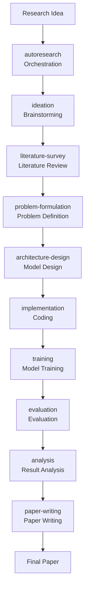

# AutoResearch - Autonomous AI Research Orchestration

The core orchestration skill that enables autonomous AI research from idea to paper. Manages the full research lifecycle and routes to domain-specific specialized skills.

## Overview

Comprehensive open-source library enabling AI agents to autonomously conduct AI research — from idea generation through experiment execution to paper writing. 87 skills spanning the full AI research lifecycle.

## When to Use This Skill

- You have a research idea and want **end-to-end autonomous conduct** of the research
- You want automated literature survey and idea generation
- You need experimental design and implementation
- You want full automation from idea to final paper
- You're using AI to accelerate your research workflow

## Full Research Lifecycle



## 22 Categories of Skills (87 Total)

| Category | Count | Description |
|----------|-------|-------------|
| **Autoresearch** | 1 | Core orchestration (this skill) |
| **Ideation** | 2 | Research brainstorming, creative thinking |
| **ML Paper Writing** | 2 | LaTeX templates, citation verification, academic plotting |
| **Model Architecture** | 5 | LitGPT, Mamba, NanoGPT, RWKV, TorchTitan |
| **Tokenization** | 2 | HuggingFace Tokenizers, SentencePiece |
| **Fine-Tuning** | 4 | Axolotl, LLaMA-Factory, PEFT, Unsloth |
| **Post-Training** | 8 | TRL, GRPO, OpenRLHF, SimPO, verl, slime, miles, torchforge |
| **Distributed Training** | 6 | DeepSpeed, FSDP, Accelerate, Megatron-Core, Lightning, Ray Train |
| **Inference & Serving** | 4 | vLLM, TensorRT-LLM, llama.cpp, SGLang |
| **Optimization** | 6 | Various optimization techniques |
| **Data Processing** | 2 | NeMo Curator, Ray Data |
| **Evaluation** | 3 | AI model evaluation methodologies |
| **Safety & Alignment** | 4 | Constitutional AI, LlamaGuard, NeMo Guardrails, Prompt Guard |
| **Agents** | 4 | AI agent architectures and frameworks |
| **RAG** | 5 | Retrieval-augmented generation techniques |
| **Multimodal** | 7 | Multi-modal models and processing |
| **Prompt Engineering** | 4 | Prompt engineering techniques |
| **MLOps** | 3 | ML operations and deployment |
| **Observability** | 2 | Training monitoring and visualization |
| **Infrastructure** | 3 | Cloud, Modal, Lambda Labs, SkyPilot |
| **Mechanistic Interpretability** | 4 | TransformerLens, SAELens, pyvene, nnsight |
| **Emerging Techniques** | 6 | Latest AI research methodologies |

## How Orchestration Works

1. **Receive research idea** from user
2. **Analyze requirements** - identify what skills are needed
3. **Route to specialized skills** - each domain skill handles its specific part
4. **Coordinate workflow** - ensure dependencies are respected
5. **Integrate results** - bring everything together
6. **Deliver final paper** - complete research output

## Benefits

- **Autonomous** - AI agent handles full lifecycle
- **Expert knowledge** - each skill has deep, expert-level guidance
- **Production-ready** - documentation from official repos, real GitHub issues, battle-tested workflows
- **End-to-end coverage** - from idea to paper
- **Always updated** - latest tools and frameworks

## Example Usage

```
I have an idea: "Improving retrieval-augmented generation with semantic chunking"
Run autoresearch to conduct full research from idea to paper.
```

**Orchestration steps:**
1. `ideation` - brainstorm research directions
2. `literature-survey` - survey existing work on RAG and chunking
3. `problem-formulation` - define research problem and hypothesis
4. `architecture-design` - design model architecture
5. `implementation` - write code for dataset, model, training loop
6. `training` - fine-tune with appropriate framework (unsloth/peft)
7. `evaluation` - evaluate against baseline retrieval
8. `analysis` - analyze results, ablation studies
9. `ml-paper-writing` - write final paper in LaTeX

## Installation

Quick install (recommended):
```bash
npx @orchestra-research/ai-research-skills
```

This installs all 87 skills automatically.

Install by category:
```bash
# Claude Code CLI - install category
/plugin marketplace add orchestra-research/AI-Research-SKILLs
/plugin install fine-tuning@ai-research-skills
```

## Quality Guarantee

Each skill:
- **Documentation sourced** from official repositories
- **Real-world examples** from actual GitHub issues
- **Battle-tested** production workflows
- **Expert-level depth** not surface-level advice
- **Regular updates** with latest frameworks

## Output

Final output is a complete research project:
```
research/
├── README.md           # Research overview
├── docs/
│   ├── ABSTRACT.md
│   ├── INTRODUCTION.md
│   ├── METHOD.md
│   ├── RESULTS.md
│   ├── DISCUSSION.md
│   └── CONCLUSION.md
├── src/                 # Source code
├── experiments/         # experiment scripts, configs
├── data/                # Data processing code
├── results/             # Results, figures, tables
└── paper/               # Final LaTeX paper
```

## Prerequisites

- Claude Code / Cursor / any agent supporting Agent Skills standard
- Python environment for experiment running
- GPU access (for model training)
- API keys (as needed by specific skills)

This is the core orchestration skill that ties together all 87 specialized AI research skills for fully autonomous research.
