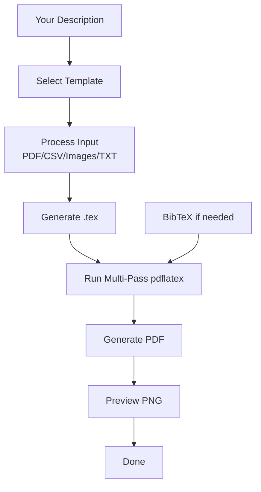

# LaTeX Document Skill

> "The capybara sat down at the typewriter. When it stood up, there was a thesis."

Universal LaTeX document skill. You describe a document in plain English, this skill produces a compiled PDF. **No LaTeX knowledge required** - the capybara handles the semicolons.

## Features

- **27 templates** compiled, tested, verified zero-error
- **27 automation scripts** for common workflows
- **26 reference guides** for LaTeX best practices
- **4 OCR profiles** for scanned document conversion
- **217 passing tests** - every template compiles cleanly
- Zero LaTeX commands required from you

## What It Can Do

| What you say | What it does |
|-------------|--------------|
| "Create my resume" | Selects ATS-optimized template, compiles PDF + PNG preview |
| "Convert my 80-page handwritten math notes to LaTeX" | OCR → markdown → colored tcolorbox theorems/definitions/examples → compile PDF with proper equations and TikZ diagrams |
| "Convert this 162-page textbook scan to a 2-page cheat sheet" | PDF → split pages → OCR → extract content → compress into 3-column landscape 7pt cheat sheet |
| "Build a quarterly report with 9 charts from this CSV" | Generate 9 chart types (bar/line/pie/scatter/heatmap/box/histogram/area/radar) from CSV → embed in report with booktabs tables → compile |
| "Create a calculus final exam with answer key" | Creates exam class document with proper question formatting, \printanswers toggle, grading table → 6 question types supported |
| "Make a NeurIPS conference poster" | Asks orientation/layout/color → generates A0 tikzposter with correct dimensions and QR code placeholder |
| "Fetch BibTeX for these DOIs" | Hits doi.org, fetches BibTeX, appends to .bib → cross-refs checked |
| "Diff v1 and v2 of my thesis with latexdiff" | Runs latexdiff → generates highlighted change-tracked PDF |
| "Password-protect this report" | Applies AES-256 encryption with print/modify restrictions |

**... and much more!** (27 templates total)

## When to Use This Skill

- You have **handwritten notes** you want converted to beautiful LaTeX
- You have a **scanned PDF** you want OCR'd and converted to clean LaTeX
- You have **CSV data** you want turned into charts and tables in a LaTeX report
- You need to create **thesis/dissertation** from chapter files
- You need a **resume/CV** in LaTeX (5 ATS-optimized templates)
- You need a **conference poster** in LaTeX
- You need an **academic paper** with journal format
- You need an **exam** with answer key
- You need **mail merge** personalized letters

## How It Works



## 27 Templates Included

### Resumes/CV (6)
| Template | Use |
|----------|-----|
| `resume-classic-ats.tex` | Classic ATS-optimized (finance/law/government) |
| `resume-modern-professional.tex` | Modern professional (tech/corporate) |
| `resume-executive.tex` | VP/Director/C-suite |
| `resume-technical.tex` | Software/data/engineering (skills matrix) |
| `resume-entry-level.tex` | New graduates (education-first) |
| `resume-legacy.tex` | Legacy with photo region (not ATS-optimized) |

### Academic Documents
| Template | Use |
|----------|-----|
| `thesis-full.tex` | Full PhD thesis/dissertation |
| `journal-article.tex` | Standard journal article |
| `conference-paper.tex` | Conference proceedings paper |
| `exam.tex` | Final exam with answer key |
| `cheatsheet.tex` | Multi-column cheat sheet |
| `neurips-poster.tex` | NeurIPS conference poster (A0) |

### Other
| Template | Use |
|----------|-----|
| `cover-letter.tex` | Job application cover letter |
| `quarterly-report.tex` | Business/academic quarterly report |
| `mail-merge.tex` | Personalized letters from CSV |

## 27 Automation Scripts

| Script | Purpose |
|--------|---------|
| `pdf-to-images.sh` | Split PDF to page images for OCR |
| `compile-latex.sh` | Multi-pass pdflatex + bibtex + biber |
| `pdf-to-ocr.sh` | Parallel OCR with progress tracking |
| `generate-chart.py` | Generate 9 chart types from CSV/JSON |
| `csv-to-latex.py` | Convert CSV to booktabs table |
| `fetch-bibtex.sh` | Fetch BibTeX from DOIs |
| `latex-diff.sh` | Generate latexdiff PDF with highlighted changes |
| `pdf-encrypt.sh` | Password protect PDF with AES-256 |
| *(19 more)* | *(see repo for complete list)* |

## Example Workflows

### Example 1: Convert Handwritten Notes to LaTeX

```
"Convert my 80-page handwritten math PDF into beautiful LaTeX lecture notes."
```

1. `pdf-to-images.sh` renders PDF at 200 DPI → one image per page
2. Parallel OCR → extracts text from each page
3. Skill detects formatting (theorems, definitions, examples)
4. Generates `.tex` with colored tcolorbox:
   - Theorems → blue box
   - Definitions → green box
   - Examples → orange box
   - Equations properly formatted
5. Compiles with multi-pass pdflatex
6. Outputs polished PDF with table of contents

Result: 80-page handwritten chaos → organized lecture notes with proper typography.

### Example 2: Generate Charts from CSV

```
"Generate 9 charts from sales-data.csv for quarterly report."
```

1. `generate-chart.py` reads CSV
2. Creates 9 chart image files (PNG) in directory
3. `csv-to-latex.py` converts CSV data to booktabs table
4. Embeds all charts and table into `quarterly-report.tex`
5. Compiles PDF → ready to submit

## Quality Guarantee

Every template is pre-compiled and tested:
- Zero LaTeX errors out of the box
- All packages correctly included
- All custom macro defined
- Tests pass before shipping

When skill generates:
- Runs compilation automatically
- If error → diagnoses and fixes
- Retries until clean compile

## Starting Prompt Example

```
Create an ATS-optimized resume for software engineering.
Experience: 5 years full-stack web development.
Education: BS Computer Science.
Skills: Python, TypeScript, React, Node.js, PostgreSQL.
```

The skill will:
1. Select `resume-modern-professional.tex` template
2. Fill in your information
3. Compile to PDF
4. Output: `output/resume/final.pdf` + preview PNG

## Requirements

- System: `pdflatex`, `bibtex`, `biber`
- OCR: `tesseract-ocr` (for scanned/PDF conversion)
- Python: pandas, matplotlib, weasyprint (for some features)
- All scripts are pre-included in the skill

## Output Structure

```
output/<project-name>/
├── main.tex                 # Main LaTeX file
├── references.bib            # Bibliography
├── figures/                # Generated figures
├── src/                    # Source chunks
├── intermediate/            # Intermediate files
├── final.pdf                # Final compiled PDF
└── preview.png              # Preview thumbnail
```

**The capybara handles the semicolons so you don't have to.**

> "When the capybara sat down at the typewriter. When it stood up, there was a thesis."
