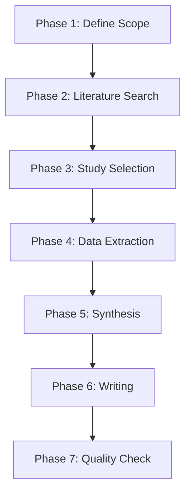

# Medical Imaging Review Skill

A systematic workflow for writing survey papers, systematic reviews, and literature analyses on medical imaging AI topics.

## Features

- **Structured 7-phase workflow** for literature review writing
- **Domain-specific templates** covering multiple medical imaging domains
- **Standardized writing style** with hedging language and citation patterns
- **Quality checklists** ensuring completeness
- **Zotero integration** for reference management

## When to Use This Skill

- You need to write a **survey paper** on medical imaging AI
- You need to write a **systematic review** in medical imaging
- You need to write a **literature review** section for your thesis/paper
- You need to organize and synthesize existing research on a medical imaging AI topic

## Supported Medical Imaging Domains

| Domain | Description |
|--------|-------------|
| **Coronary Artery Analysis (CCTA)** | Coronary CT angiography analysis |
| **Lung Imaging (CT/X-ray)** | Lung cancer detection, COPD analysis |
| **Brain Imaging (MRI/CT)** | Brain tumor, stroke, neurodegenerative diseases |
| **Cardiac Imaging (MRI/CT/Echo)** | Cardiac function and disease analysis |
| **Pathology (Whole Slide Images)** | Digital pathology image analysis |
| **Retinal Imaging (Fundus/OCT)** | Diabetic retinopathy, glaucoma |

## 7-Phase Systematic Workflow



### Phase 1: Define Scope
- Define research question and scope
- Inclusion/exclusion criteria
- Time period (e.g., 2018-2024)
- Specific imaging modality
- AI method categories

### Phase 2: Literature Search
- Search major databases (PubMed, arXiv, IEEE Xplore, ACM Digital Library)
- Snowballing from key papers
- Identify landmark studies
- Filter by inclusion criteria

### Phase 3: Study Selection
- Two-stage screening (title/abstract → full text
- Record reasons for exclusion
- Build final paper set
- Quality assessment of included studies

### Phase 4: Data Extraction
- Extract key information from each study
- Methodological quality assessment
- Performance data extraction
- Organize by methodological categories

### Phase 5: Synthesis
- Thematic analysis of field
- Identify trends and patterns
- Identify research gaps
- Identify methodological challenges
- Identify future research directions

### Phase 6: Writing
- Follow domain-specific template
- Organize by theme/method, not by paper
- Synthesize don't summarize
- Maintain proper academic tone with hedging

### Phase 7: Quality Check
- Run quality checklist
- Verify inclusion/exclusion reported
- All major perspectives covered
- Research gap clearly articulated
- Future research directions clearly stated

## Quality Checklist

Before completion, verify:

- [ ] Research question clearly defined
- [ ] Inclusion/exclusion criteria explicit
- [ ] Search strategy described in detail
- [ ] Study selection process described
- [ ] Data extraction procedure documented
- [ ] Studies synthesized thematically
- [ ] Research gap clearly identified
- [ ] All major schools of thought covered
- [ ] Methodological strengths/weaknesses discussed
- [ ] Future research directions identified
- [ ] Minimum 50+ references (for full review
- [ ] Domain-specific content complete

## Output Structure

```
review/
├── REVIEW.md              # Full literature review
├── SCOPE.md             # Scope and inclusion/exclusion
├── INCLUDED.csv          # Table of included studies
├── REFERENCES.bib        # BibTeX format references
├── QUALITY_CHECK.md      # Completed quality checklist
└── FIGURES/
    ├── taxonomy.png       # Taxonomy diagram
    └── trend.png         # Trends analysis figure
```

## Writing Style

- Use **hedging language:
- "Recent studies suggest that..."
- "It appears that..."
- "Current evidence indicates..."
- "Further research is needed to confirm..."
- Avoid overclaiming is unethical in review writing

Citation patterns:
- Cite foundational papers
- Cite recent key papers (last 3-5 years)
- Cite conflicting findings
- Don't selectively cite only confirming results

## MCP Integration

If MCP available:
- **Zotero**: Import your existing library
- **arXiv**: Search recent preprints
- **PubMed**: Search biomedical literature

## Example Usage

```
Write a systematic review on deep learning for lung cancer detection in CT imaging.
Include studies from 2018-2024.
```

The skill will:
1. Define scope with inclusion/exclusion
2. Search literature from multiple sources
3. Select studies per criteria
4. Synthesize findings thematically
- Organize by method categories
6. Identify research gaps
7. Write full review
8. Complete quality checklist
9. Deliver final review

## Domain-Specific Guides

Each domain includes:
- Predefined method categories
- Standard dataset references
- Common evaluation metrics
- Historical development trends
- Common challenges identified
- Benchmark datasets reference
