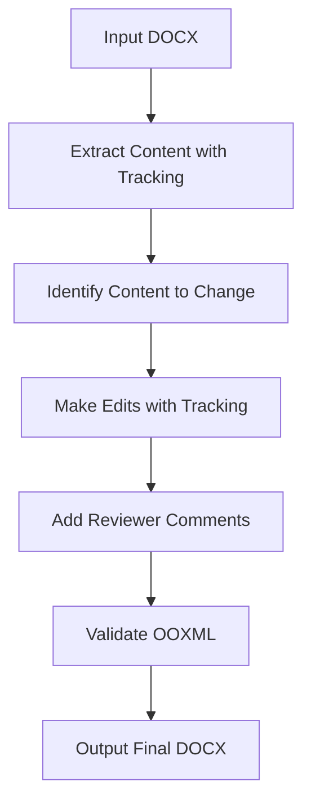

# Office Word (DOCX) Skill

Professional Word document creation and editing workflows for Claude Code. Supports tracked changes, OOXML manipulation, and professional editing workflows.

## When to Use This Skill

- You need to **edit an existing Word document** with tracked changes
- You need to **add comments** to a Word document
- You need to **modify document structure** while preserving formatting
- You need to **extract text** with change tracking preserved
- You need professional **redlining workflows** for review

## Key Capabilities

- **Tracked changes (redlining)** - Professional document editing with change tracking
- **OOXML manipulation** - Direct XML manipulation for precise control, preserve formatting
- **Add comments** - Insert reviewer comments in the document
- **Text extraction** - Export content with tracked changes preserved
- **Structure modification** - Add/remove sections, modify existing content

## Workflow: Editing with Tracked Changes



### Step-by-step:

1. **Extract document content**
   - Read existing DOCX
   - Preserve tracked changes information
   - Identify current content and formatting

2. **Identify changes needed**
   - Which sections need editing
   - What content to add/remove/modify

3. **Apply changes with tracking**
   - Original content stays, changes are marked
   - Preserve existing formatting
   - Maintain document structure

4. **Add comments** (if needed)
   - Insert reviewer comments on specific changes
   - Explain reasoning for changes

5. **Validate OOXML**
   - Check that XML is well-formed
   - Ensure no corruption

6. **Output final document**
   - Save to outputs directory

## Supported Operations

| Operation | Description |
|-----------|-------------|
| Insert text | Insert new text with tracked changes |
| Delete text | Delete text with tracked deletion |
| Modify text | Change existing text, track change |
| Add comment | Add reviewer comment on range |
- Reorganize | Move sections, track changes |

## Available Scripts

| Script | Purpose |
|--------|---------|
| `extract-text.py` | Extract text with tracking information |
| `apply-changes.py` | Apply tracked changes to document |
| `add-comment.py` | Add comments to specific ranges |
| `validate-docx.py` | Validate OOXML structure |

## Output Organization

```
outputs/<project-name>/
├── original.docx          # Backup of original
├── working.docx           # After edits
├── extracted-text.json    # Extracted content with positions
├── changes.json          # Changes to apply
└── final.docx            # Final document with tracked changes
```

## Example Usage

**User:**
```
Edit this Word document proposal.docx, add a new section on methodology after introduction, and track all changes.
```

The skill will:
1. Extract document content and structure
2. Add new section with tracked insertion
3. Validate OOXML
4. Output final document with all changes tracked

Works with other office skills (pptx/xlsx/pdf) for complete document workflow automation.
