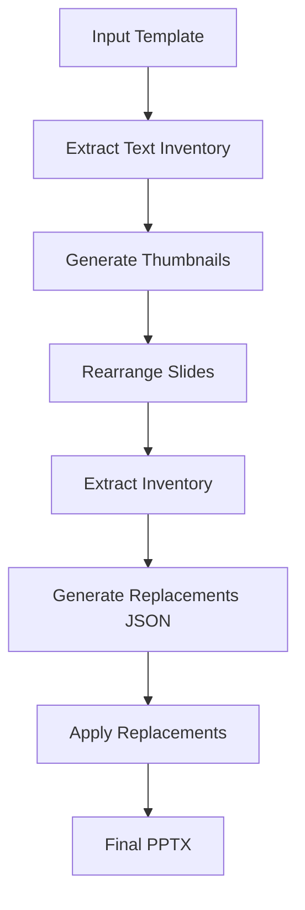

# Office PowerPoint (PPTX) Skill

Professional PowerPoint creation and editing workflows for Claude Code. Create presentations from scratch or templates, with automation support.

## When to Use This Skill

- You need to **create a new PowerPoint presentation** from scratch
- You need to **edit an existing presentation** (rearrange slides, replace text)
- You want to **design slides in HTML/CSS** and convert to PPTX with full formatting
- You need to **generate thumbnail previews** to check text cutoff and layout issues
- You need **direct OOXML manipulation** for precise control

## Key Capabilities

- **HTML-to-PPTX conversion** - Design slides in HTML/CSS, render to PPTX with full formatting
- **Template-based creation** - Rearrange slides, replace text with JSON, preserve formatting
- **Visual validation** - Generate thumbnail grids to catch text cutoff and layout issues
- **OOXML editing** - Direct XML manipulation for precise control

## Workflow: Create Presentation from Template



### Step-by-step:

1. **Extract template text**
   ```bash
   venv/bin/python -m markitdown template.pptx
   ```

2. **Generate thumbnails** for visual checking
   ```bash
   python public/pptx/scripts/thumbnail.py template.pptx outputs/project/thumbnails
   ```

3. **Rearrange slides** (reorder/slide selection)
   ```bash
   python public/pptx/scripts/rearrange.py template.pptx outputs/project/working.pptx 0,5,5,12,3
   ```

4. **Extract text inventory** (all text with positions)
   ```bash
   python public/pptx/scripts/inventory.py outputs/project/working.pptx outputs/project/inventory.json
   ```

5. **Generate replacements JSON** (your content matching inventory)
   - Creates `outputs/project/replacements.json`

6. **Apply replacements** to get final PPTX
   ```bash
   python public/pptx/scripts/replace.py inputs/template.pptx outputs/project/replacements.json outputs/project/final.pptx
   ```

## Workflow: HTML-to-PPTX

Write your slide content in HTML/CSS (easy styling, responsive design), then convert to PPTX:

1. Write HTML/CSS for each slide
2. Run conversion script
3. Get PPTX with all formatting preserved

See `html2pptx.md` for complete guide.

## Workflow: OOXML Direct Editing

For advanced editing needs (custom shapes, precise positioning), edit the XML directly:

See `ooxml.md` for guide on direct XML manipulation.

## Available Scripts

| Script | Purpose |
|--------|---------|
| `thumbnail.py` | Generate thumbnail grid for visual validation |
| `rearrange.py` | Rearrange/reorder slides |
| `inventory.py` | Extract text inventory with positions |
| `replace.py` | Apply text replacements from JSON |

## Output Organization

All outputs go to:
```
outputs/<project-name>/
├── thumbnails/          # PNG thumbnails per slide
├── working.pptx          # After rearrangement
├── inventory.json        # Text inventory
├── replacements.json     # Your content replacements
└── final.pptx           # Final presentation
```

## Prerequisites

- Python dependencies: `pip install -r requirements.txt`
- Node.js (for html2pptx): `npm install`
- System tools: LibreOffice (soffice), Poppler (pdftoppm)

## Example Usage

**User:**
```
Create a quarterly sales presentation with 5 slides from template.pptx
Sales data in quarterly-sales.csv
```

The skill will:
1. Extract template inventory
2. Generate thumbnails for checking
3. Create replacement JSON with your sales data
4. Apply replacements
5. Deliver final PPTX

This skill handles the PowerPoint automation workflow. Works with other office skills (docx/xlsx/pdf) for complete document automation.
