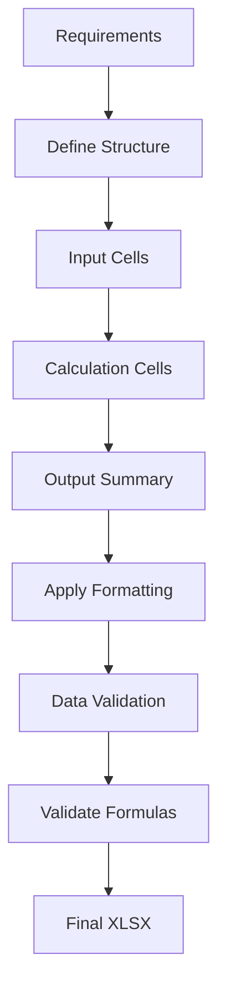

# Office Excel (XLSX) Skill

Professional Excel spreadsheet creation and modeling for Claude Code. Build financial models with working formulas, professional formatting, and zero-error validation.

## When to Use This Skill

- You need to **build a financial model** with working formulas
- You need **professional formatting** (color-coded inputs, custom number formats)
- You need **data validation** (drop-down lists, range checks)
- You need to create a **budget spreadsheet** with formulas
- You need to edit an existing Excel file with formula preservation

## Key Capabilities

- **Formula-based models** - Working formulas with zero-error requirement
- **Professional formatting** - Color-coded inputs/formulas, custom number formats
- **Data validation** - Correct cell styling, proper input formatting
- **Best practice conventions**: Years as text, zeros formatted as "-", proper cell styling
- **Formula preservation** - Edit without breaking existing formulas

## Workflow: Create Financial Model



### Step-by-step:

1. **Define spreadsheet structure**
   - Identify input sections, calculation sections, output sections
   - Plan sheet organization

2. **Create input cells**
   - Color-code input cells (common: light blue fill)
   - Add data validation where appropriate
   - Add comments explaining inputs

3. **Add calculation cells with formulas**
   - Correct Excel formula syntax
   - Proper cell referencing (absolute/relative)
   - Verify formula logic

4. **Create output summary**
   - Pull key results from calculations
   - Format for readability

5. **Apply professional formatting**
   - Column widths
   - Cell borders
   - Number formats (currency, percentage, etc.)
   - Color coding (inputs vs calculations vs outputs)

6. **Add data validation**
   - Drop-down lists for categorical inputs
   - Range validation for numeric inputs

7. **Validate all formulas**
   - Check for formula errors
   - Verify calculation chains work correctly

8. **Save final XLSX** to outputs directory

## Formatting Conventions (Best Practice)

| Element | Format |
|---------|--------|
| **Input cells** | Light blue fill, border |
| **Calculation cells** | Light gray fill |
| **Output cells** | Light green fill, bold |
| **Zero values** | Display as "-" (custom format) |
| **Years** | Text format (avoid calculation on years) |

## Available Scripts

| Script | Purpose |
|--------|---------|
| `validate-formulas.py` | Check all formulas for errors |
| `extract-schema.py` | Extract cell schema, formulas, formatting from existing |
| `apply-formatting.py` | Apply standard formatting conventions |

## Output Organization

```
outputs/<project-name>/
├── original.xlsx              # Backup of original (if editing)
├── schema.json               # Extracted cell schema
├── working.xlsx              # Working file during edits
└── final.xlsx               # Final validated spreadsheet
```

## Example Usage

**User:**
```
Build an Excel financial model for a 5-year startup budget projection.
Inputs: initial funding $500K, monthly burn $50K, growth 5% per year.
```

The skill will:
1. Create sheet structure (Inputs, Monthly Projections, Annual Summary)
2. Add input cells with formatting
3. Create calculation formulas for 5-year projection
4. Apply professional formatting
5. Validate all formulas
6. Deliver final validated XLSX

## Prerequisites

- Python dependencies: `pip install -r requirements.txt` (openpyxl)
- All formulas are checked for errors before completion
- Zero-error guarantee for formula calculation chains

Works with other office skills (pptx/docx/pdf) for complete document automation.
