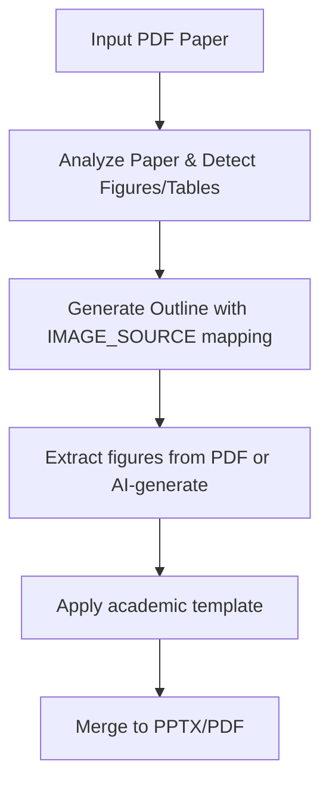

# Paper Slide Deck Skill

Transform academic papers into professional slide decks with automatic figure detection and AI-generated visuals.

## Features

- **Auto figure detection** from PDF papers
- **Smart figure-to-slide mapping** based on caption analysis
- **17 visual styles** (academic-paper, sketch-notes, minimal, etc.)
- **Gemini API integration** for AI slide generation
- **PPTX/PDF export** with merge scripts
- Handles tables as well as figures

## When to Use This Skill

- You need to create presentation slides from an accepted academic paper
- You want to convert your published paper to a conference talk
- You need to prepare a defense presentation from your thesis
- You want to share a paper with automatic figure extraction

## Workflow



### Step 1: Analysis
- Read paper and detect all figures and tables
- Analyze captions to understand content
- Extract section structure from paper
- Build slide outline based on paper structure

### Step 2: Outline Generation
- Title slide (title, authors, affiliation)
- Introduction/Background slides
- Methodology slides
- Results slides (one figure per slide usually)
- Discussion slides
- Conclusion slide
- References slide

Each slide includes:
- Slide title from section/figure caption
- Text content from paper (summarized)
- Figure/image source mapping
- Notes for speaker

### Step 3: Figure Handling
- If PDF has figures: extract them directly
- If figures not extractable: AI-generate based on captions
- Place figures in appropriate slides
- Add proper captions and citations

### Step 4: Template Application
- Apply chosen visual style
- Ensure consistent formatting
- Generate final output

## Visual Styles Available

| Style | Description |
|-------|-------------|
| `academic-paper` | Clean, traditional academic style |
| `sketch-notes` | Hand-drawn sketch style for informal talks |
| `minimal` | Minimalist, text-focused |
| `modern` | Clean modern with accents |
| `dark` | Dark theme for presentations |
| ... (12 more) | 17 styles total |

## Output Files

```
slide-deck/
├── README.md                 # Overview and usage
├── SLIDE_OUTLINE.md         # Slide-by-slide outline with figure mapping
├── extracted-figures/       # Extracted image files
├── generated-figures/       # AI-generated figures (if needed)
├── template/                 # Applied template files
└── output/
    ├── deck.pptx             # Final PowerPoint
    └── deck.pdf              # Final PDF
```

## Example Usage

**User prompt:**
```
Generate slides from my paper "attention-is-all-you-need.pdf", style: academic-paper
```

**What the skill does:**
1. Analyzes PDF paper, detects 6 figures and 2 tables
2. Generates slide outline with 13 slides
3. Extracts figures from PDF
4. Applies academic-paper template
5. Outputs PPTX ready for presentation

## Starting Prompt

```
Generate professional slides from [paper.pdf], style: [style-name]
```

The skill will:
1. Analyze the paper
2. Detect figures and tables
3. Create slide outline
4. Extract/generate figures
5. Apply template
6. Deliver final slide deck

## Dependencies

- Requires Node.js/Python for extraction scripts
- Gemini API key optional (for AI figure generation when extraction fails)
- Works best with text-based PDFs (not scanned)

## Integration with Academic Workflow

Works well after:
- `academic-paper-strategist` + `academic-paper-composer` → after paper writing
- `research-proposal` → create slides for proposal defense
- Any published paper → conference preparation

The output PPTX can be edited manually after generation for final adjustments.
