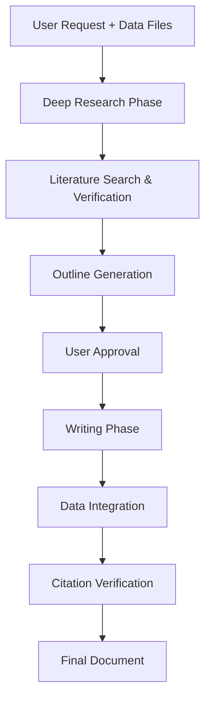

# Scientific Writer

A deep research and writing tool that combines the power of AI-driven deep research with well-formatted written outputs. Generate publication-ready scientific papers, reports, grant proposals, posters, literature reviews, and more academic documents—all backed by real-time literature search and verified citations.

## Features

- **Deep research first**: Comprehensive research before writing ensures every claim is supported by real, verifiable sources
- **Real-time literature lookup**: Integrates research search to find recent papers
- **Intelligent paper detection**: Identifies key papers and extracts relevant findings
- **Comprehensive document conversion**: Handles various input formats (CSV data, images, diagrams)
- **AI-powered diagram generation**: Generates scientific diagrams and figures
- **Publication-ready output**: Organized sections proper academic format
- **Data integration**: Incorporates your experimental data (CSV, images, figures) directly into the paper

## When to Use This Skill

- You need to create a **full scientific paper** from your experimental data
- You want to write a **grant proposal** with preliminary results
- You need to generate a **conference poster** with your findings
- You want a **literature review** on a specific research topic
- You need to compare your experimental data with published benchmarks
- You want a **research report** with proper citations and references

## Workflow



### 1. Research Phase
- Understand user request and data files
- Conduct deep literature search on the topic
- Identify key papers and extract relevant findings
- Verify claims against existing literature
- Identify research gap and your contribution

### 2. Outline Phase
- Generate detailed outline based on research and your data
- Include sections for abstract, introduction, methods, results, discussion
- Plan figure/table placement with your data
- Wait for user approval before writing

### 3. Writing Phase
- Write full manuscript section-by-section
- Integrate your data files (CSV → tables/plots, images → figures)
- Add proper citations for all claims
- Generate diagrams if needed
- Format for target journal venue

### 4. Finalization
- Verify all citations
- Check reference formatting
- Generate final document in Markdown
- Provide conversion instructions for PDF/LaTeX

## Supported Document Types

| Document Type | Description |
|---------------|-------------|
| **Research Paper** | Full scientific paper for journal submission |
| **Grant Proposal** | NSF/NIH-style grant proposal with timeline and budget |
| **Literature Review** | Systematic review of field with synthesis |
| **Conference Poster** | Structured poster content with figure placeholders |
| **Research Report** | Technical research report for institution |
| **Response to Reviewers** | Point-by-point response letter |

## Data Integration

The skill can incorporate:

- **CSV data files**: Automatically converted to tables or descriptive statistics
- **Image files (PNG/JPG)**: Included as figures with captions
- **SVG diagrams**: Incorporated directly
- **Excel spreadsheets**: Data extracted and summarized
- Your experimental results are properly referenced in the text

## Example Usage

**User prompt:**
```
Create a Nature paper on CRISPR gene editing. Present experimental_data.csv (efficiency across 5 cell lines), include Western_blot.png and flow_cytometry.png showing 87% editing efficiency (p<0.001). Compare with literature benchmarks.
```

**What the skill does:**
1. Searches recent CRISPR editing literature
2. Finds benchmark efficiencies from published papers
3. Creates outline with appropriate sections
4. Writes full paper integrating your data
5. Compares your 87% efficiency against 70-75% typical benchmark
6. Adds proper citations and references

## Starting Commands

After plugin installation and initialization:
```
/scientific-writer:init
```

Then just ask:
```
Create a Nature paper on [topic]. Present [data files]...
```

## Requirements

- Python 3.10-3.12
- ANTHROPIC_API_KEY (required)
- OPENROUTER_API_KEY (optional, for research lookup)

## Output Format

Output is organized as:
```
scientific-output/
├── PAPER.md              # Full manuscript in Markdown
├── ABSTRACT.md           # Standalone abstract
├── REFERENCES.md         # Formatted references list
├── FIGURES/              # Generated diagrams (if any)
└── CHECKLIST.md          # Submission checklist
```

Convert to PDF/LaTeX:
```bash
pandoc -s PAPER.md -o PAPER.pdf
# or
pandoc -s PAPER.md -o PAPER.tex
```

## Integration with Claude Code

Works best as a Claude Code plugin providing seamless scientific writing directly in your IDE. All research and writing happens in context with your data files already available.
