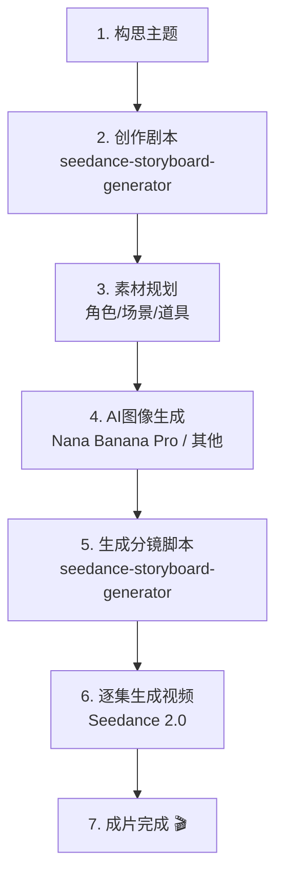

# Seedance 2.0 Storyboard Generator

一句话：试错成本越来越高，提示词的重要性从来没有像今天这样大。Seedance 2.0 Storyboard Generator 开源剧情剧本 Skill 工具，帮你一键写好剧本 - 将小说/故事转化为多集视频。

## Why This Project?

Because Seedance 2.0 has changed everything. We need a new剧本 creation tool that better leverages the capabilities of new AI and makes it easier to create short dramas.

## Complete AI Video Production Workflow



**Three-tool pipeline:**
1. **Claude Code** - 剧本创作与分镜脚本生成 (this skill)
2. **Nana Banana Pro** - 角色、场景、道具素材图像生成 (optional other image AI)
3. **Seedance 2.0** - 视频生成与延长

## When to Use This Skill

- You have a story/novel you want to turn into a **multi-episode short drama video**
- You want to **automate the story-to-video workflow**
- You need to generate **Seedance 2.0 formatted storyboard prompts**
- You want to **organize material prompts** for consistent style and character recognition
- You're starting a new **AI short drama series** and need proper setup

## Detailed Step-by-Step Workflow

### Step 1: Script Writing - Adapt Source Material to Four-Act Structure

Take your source material (novel excerpt, original story) and adapt it into a **four-act structure** (setup → confrontation → resolution → cliffhanger):

1. **Act 1: Setup** - Introduce characters, setting, establish conflict
2. **Act 2: Confrontation** - Conflict development, rising action
3. **Act 3: Resolution** - Climax, main conflict resolution
4. **Act 4: Cliffhanger** - End with hook for next episode

Output: `[Title]_剧本.md` - complete four-act structure script

### Step 2: Material Planning - Create Numbered Material Prompt List

Create numbered list of:
- **C** - Characters (multiple angles)
- **S** - Scenes/Locations
- **P** - Props/Items

Format example:
```
- C01 - 林冲·正面全身
- C02 - 林冲·侧面半身
- C03 - 林冲·脸部特写
- S01 - 沧州草料场·雪景
- S02 - 山神庙·夜晚
- P01 - 长枪
```

Output: `[Title]_素材清单.md` - numbered material generation prompts

### Step 3: Image Generation - Generate Visual Assets with Nana Banana Pro

Use Nana Banana Pro (or other image AI) to generate all character/scene/prop images from your material list. Save generated images to `materials/` directory.

### Step 4: Storyboard Generation - Create Seedance 2.0 Timelined Prompts

Generate per-episode storyboard in Seedance 2.0 format including:

1. **Material List** - Table mapping material slot to file:
   | Material Slot | File | Description |
   |-------------|------|-------------|
   | Image 1 | C01 | Character reference |

2. **Seedance Prompt** (timeline format) with:
   - Style specification (e.g., "Chinese ink wash painting style mixed with anime cel-shading, 9:16 vertical")
   - **Timeline** with timing for each segment:
     ```
     0-3 seconds: aerial drone shot establishing scene
     3-6 seconds: camera push in introducing protagonist
     ...
     ```
   - **Audio** - BGM style + sound effects + dialogue
   - **References** - `@ImageName` for each material

3. **Last frame description** - For video extension connection between episodes

Output: `[Title]_E[XX]_分镜.md` per episode

### Step 5: Video Generation - Use Seedance 2.0 to Generate Video

Follow Seedance 2.0 procedure for video generation:

- Upload your images to Seedance 2.0
- For episode 2 and beyond: use **video extension** to continue from previous episode
- This creates seamless transitions between episodes

## File Naming Convention

| Type | Naming Format | Description |
|------|---------------|-------------|
| Complete Script | `[Title]_剧本.md` | Four-act structure full script |
| Material List | `[Title]_素材清单.md` | Numbered generation prompts |
| Episode Storyboard | `[Title]_E[XX]_分镜.md` | Per-episode Seedance format |

## Material Numbering Convention

| Type | Prefix | Range | Example |
|------|--------|-------|---------|
| Character (multi-angle) | **C** | C01-C99 | C01 林冲·正面全身 |
| Scene/Location | **S** | S01-S99 | S01 沧州草料场·雪景 |
| Prop/Item | **P** | P01-P99 | P01 长枪 |

## Seedance 2.0 Prompt Format Requirements

Each episode storyboard must contain three parts:

### 1. Material List

| Material Slot | File | Description |
|--------|------|-------------|
| Image 1 | C01 | 角色参考 |
| Image 2 | S01 | 场景参考 |

### 2. Seedance Prompt (Timeline Format)

```
[Style specification]
[timing] - [shot description]
[timing] - [shot description]
[timing] - [shot description]

【声音】 BGM style + sound effects + dialogue
【参考】 @Image1 角色, @Image2 场景...
```

**Style specification** example:
> Chinese ink wash painting style mixed with anime cel-shading, 9:16 vertical video, gray-black ink wash tone

**Timing** example:
```
0-3 seconds: high-angle aerial shot establishing the snow scene
3-6 seconds: slow camera push in introducing Lin Chong
...
```

### 3. Last Frame Description

Describe the final frame of this episode for seamless extension to next episode:

> Final frame: Lin Chong stands at the entrance of the mountain temple, snow falling heavily around him.

## Video Extension for Multi-Episode Series

Starting from episode 2, use video extension to maintain continuity:

```
Extend [previous-video.mp4] by 15 seconds
```

Add at the beginning of your prompt:
```
Extend @previous-video 15s
```

This creates seamless transitions between episodes:
```
Opening (new episode) → Episode 1 (generated) → Episode 2 (extend Episode 1) → Episode 3 (extend Episode 2) → ...
```

## Style Consistency

**Important:** All material generation prompts **must start with the same style prefix**, for example:
```
Chinese ink wash painting style mixed with anime cel-shading
```

**Character recognition:** Different color schemes and visual markers to distinguish different characters so AI can recognize them consistently.

## Important Limitations

- **Maximum 9 images** per Seedance 2.0 generation
- **Maximum 3 videos** (total 15s) as reference
- Sensitive words may cause generation failure (e.g., "river lake people" in Chinese censoring)
- Video editing capabilities are limited - most modifications require regeneration
- Complex prompts (300+ words) may have instruction following inconsistency

## Camera Movement Keywords

Use these keywords for precise camera control:

| Category | Keywords |
|----------|----------|
| Push | **推近**, 推镜头, 缓慢推近, 急速推进 |
| Pull | **拉远**, 拉镜头, 逐渐拉远 |
| Move Horizontal | **左摇**, 右摇, 横移 |
| Follow | **跟随镜头**, 跟拍 |
| Orbit | **环绕镜头**, 360-degree rotation |
| Elevation | **升镜头**, 降镜头, 俯冲 |
| Special | **希区柯克变焦**, 一镜到底 |
| Handheld | **手持晃动 |

## Example Usage

**User prompt:**
```
seedance 风云中聂风小时候的故事
```

**What the skill does:**
1. Analyze the story, create four-act structure script
2. Break into multiple episodes
3. Create material list (characters/scenes/props) with proper numbering
4. Generate per-episode storyboard in Seedance 2.0 format
5. Ready for image generation → video generation

## Output Directory Structure

```
project-name/
├── [ProjectName]_剧本.md              # Complete four-act script
├── [ProjectName]_素材清单.md          # Numbered material prompts
├── [ProjectName]_E01_分镜.md        # Episode 1 storyboard (Seedance format)
├── [ProjectName]_E02_分镜.md        # Episode 2 storyboard
├── ...
├── materials/                         # Generated images go here
│   ├── C01.png
│   ├── C02.png
│   └── ...
└── README.md                         # Project usage guide
```

## Reference Documents

- `references/seedance-manual.md` - Complete Seedance 2.0 user manual
- `references/script-conversion.md` - Story-to-video conversion template

## Integration

This skill works seamlessly with the complete workflow:
1. You: `seedance [your story]` → this skill → script + materials + storyboards
2. You: generate images with Nana Banana (or other AI) from material list
3. You: upload images + storyboards to Seedance 2.0 → generate video
4. Done! You have your AI-generated short drama series
