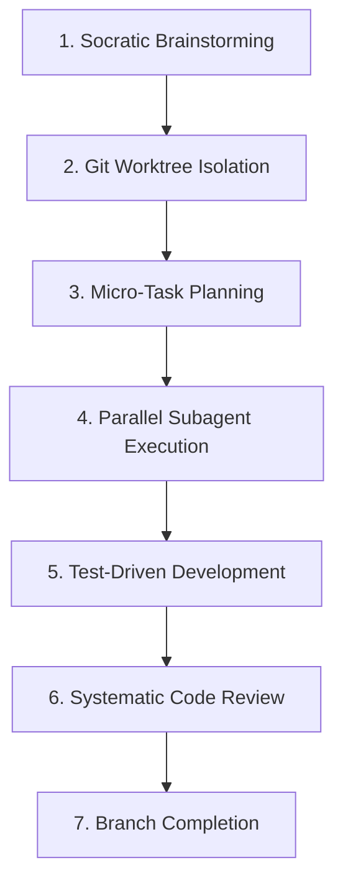

# Superpowers - Disciplined AI Development Framework

Superpowers transforms your AI coding assistant from "just writing code" to systematic engineering development. Enforces disciplined workflows that result in 85-95% test coverage vs 30-50% with ad-hoc Claude Code.

## When to Use This Skill

- You want **disciplined AI development** instead of ad-hoc coding
- You need **high test coverage** on your project
- You want **systematic debugging** instead of guesswork
- You're working on a **production feature** that needs quality
- You want **parallel subagent execution** for faster development
- You want enforced **test-driven development** (RED-GREEN-REFACTOR)

## Core 7-Phase Enforced Workflow



### 1. Socratic Brainstorming
**Before any coding**, force a dialogue:
- What exactly do you want to build?
- What are the constraints?
- What are the edge cases?
- Are there alternative approaches to consider?

*Goal: Clarify requirements before coding*

### 2. Git Worktree Isolation
- Create isolated git worktree for feature development
- Main branch stays working
- No interference with ongoing work
- Easy cleanup when done

### 3. Micro-Task Planning
- Break work into **2-5 minute tasks**
- Each task precisely specifies:
  - Which file to change
  - What code to write
  - How to verify it works

> "Clear enough that an enthusiastic but judgment-free junior dev could do it"

### 4. Parallel Subagent Execution
- Multiple subagents work on separate tasks in parallel
- 3-4x speedup compared to sequential execution
- Each subagent focuses on one micro-task

### 5. Test-Driven Development (Enforced)
**Strict RED-GREEN-REFACTOR cycle enforced:**
1. **RED**: Write a failing test that defines the feature
2. **GREEN**: Write just enough code to make the test pass
3. **REFACTOR**: Clean up while keeping tests green

- If AI writes code before tests → **code is auto-deleted**
- No exceptions. This discipline is what delivers quality.

### 6. Systematic Code Review
- Two automated review passes:
  1. Specification compliance check
  2. Code quality review
- Issues fixed before completion

### 7. Branch Completion
- All tests passing
- Documentation updated
- Merge back to main branch
- Cleanup isolated worktree

## Built-in Skills (14)

| Skill | Purpose |
|-------|---------|
| `test-driven-development` | Enforce RED-GREEN-REFACTOR TDD cycle |
| `systematic-debugging` | 4-phase root cause analysis debugging |
| `verification-before-completion` | Verify bug fix actually fixes bug |
| `brainstorming` | Socratic dialogue to clarify requirements |
| `writing-plans` | Create detailed implementation plans |
| `executing-plans` | Execute in micro-tasks with checkpoints |
| `dispatching-parallel-agents` | Run multiple subagents in parallel |
| `subagent-driven-development` | Two-pass review for rapid iteration |
| `requesting-code-review` | Self-review checklist before completion |
| `receiving-code-review` | Process and respond to code review feedback |
| `using-git-worktrees` | Isolated feature development on worktree |
| `finishing-a-development-branch` | Merge, test, cleanup completed branch |
| `writing-skills` | Create new skills from instruction (meta-skill) |
| `using-superpowers` | Introduction to using the system |

## Key Benefits

- **85-95% test coverage** automatically (vs 30-50% ad-hoc)
- **Faster debugging** with systematic root cause analysis
- **Parallel execution** 3-4x speedup on multiple tasks
- **Discipline** that produces more reliable code
- **Works with all agent** - Claude Code, Cursor, Codex, Gemini CLI

## Example Usage

**User:**
```
Help me implement a user authentication feature with JWT.
```

**What superpowers does:**
1. Asks clarifying questions about requirements, constraints, edge cases
2. Creates isolated git worktree
3. Breaks into micro-tasks (each 2-5 minutes)
4. Dispatches subagents to work in parallel
5. Each subagent follows strict TDD: failing test → passing code → refactor
6. Automated two-pass code review
7. Merge, test, cleanup

## Installation

### Claude Code (official marketplace):
```
/plugin install superpowers@claude-plugins-official
```

### Claude Code (third-party marketplace):
```
/plugin marketplace add obra/superpowers-marketplace
/plugin install superpowers@superpowers-marketplace
```

## Philosophy

> "AI coding tools are fast, but they're fast in the wrong things—they skip planning, they skip tests, they skip review. Superpowers enforces the discipline that turns 'feels fast' into actually fast with quality."

## Why It Works

Traditional AI coding: You say "build this", AI codes immediately, you spend hours debugging and fixing tests.

**With Superpowers**: 10-20 minutes planning overhead, but implementation is 2-3x faster with fewer bugs. **Net: faster delivery with higher quality.**

This skill enables the Superpowers workflow when the agent automatically detects development tasks.
