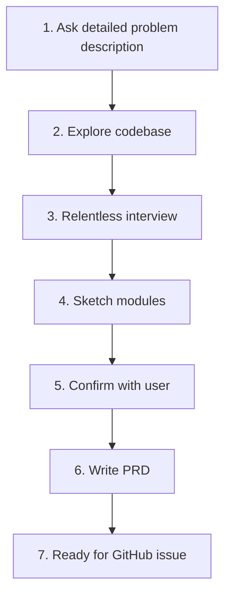

# Write a PRD - Product Requirements Document Writer

Guided workflow for creating clear, structured Product Requirements Documents (PRD) that engineers actually read and understand.

## When to Use This Skill

- You need to create a **PRD** for a new product feature
- You want to document requirements before coding
- You need clear requirements for engineering team
- You want to avoid scope creep and miscommunication
- You want a structured template that follows best practices

## Workflow



### Step 1: Ask for Detailed Description

Ask the user for a **long, detailed description** of:
- The problem they want to solve
- Any potential ideas for solutions
- Existing context from their perspective

### Step 2: Explore the Repo

Explore the codebase to:
- Verify user assertions
- Understand the current state of the codebase
- See existing patterns and conventions
- Identify what needs to change

### Step 3: Relentless Interview

**Interview the user relentlessly** about every aspect until shared understanding:
- Walk down each branch of the design tree
- Resolve dependencies between decisions one-by-one
- Resolve ambiguity on every decision
- Don't stop until every question answered

### Step 4: Sketch Major Modules

Sketch out the major modules you need to **build or modify**:

- Look for opportunities to extract **deep modules**
- A deep module encapsulates a lot of functionality in a simple, testable interface which rarely changes
- Encapsulation → better testability → better maintainability
- Check with user that these modules match expectations
- Ask user which modules they want tests written for

### Step 5: Confirm with User

- Confirm module breakdown
- Confirm testing decisions
- Get green light before writing PRD

### Step 6: Write PRD from Template

Follow this template for GitHub issue submission:

## PRD Template (for GitHub Issue)

## Problem Statement

The problem that the user is facing, from the user's perspective.

## Solution

The solution to the problem, from the user's perspective.

## User Stories

A LONG, numbered list of user stories. Each user story should be in the format:

1. As an `<actor>`, I want a `<feature>`, so that `<benefit>`

Example:
```
1. As a mobile bank customer, I want to see balance on my accounts, so that I can make better informed decisions about my spending
```

This list should be **extremely extensive** and cover **all aspects** of the feature.

## Implementation Decisions

A list of implementation decisions that were made. This can include:

- The modules that will be built/modified
- The interfaces of those modules that will be modified
- Technical clarifications from the developer
- Architectural decisions
- Schema changes
- API contracts
- Specific interactions

**DO NOT include** specific file paths or code snippets - they quickly become outdated.

## Testing Decisions

A list of testing decisions that were made. Include:

- A description of what makes a good test (only test external behavior, not implementation details)
- Which modules will be tested
- Prior art for the tests (i.e., similar types of tests in the codebase)

## Out of Scope

A description of the things that are out of scope for this PRD.

## Further Notes

Any further notes about the feature.

## When to Skip Steps

You **may skip steps** if you don't consider them necessary for small features.

## PRD Best Practices

- **Extensive user stories** - cover all aspects, don't miss edge cases
- **Deep module extraction** - good encapsulation improves testability
- **Test planning upfront** - decide what needs testing before coding
- **One decision at a time** - resolve dependencies sequentially
- **No code paths in PRD** - keep it high-level, don't lock into file paths prematurely

## Starting Prompt Example

```
write-a-prd: Add dark mode toggle to the user settings page
```

The skill will:
1. Ask for detailed problem/solution description
2. Explore the codebase to understand current state
3. Interview relentlessly until full shared understanding
4. Sketch modules and identify deep extractable modules
5. Confirm with user on modules and testing
6. Write PRD following the template
7. Ready to copy as GitHub issue
