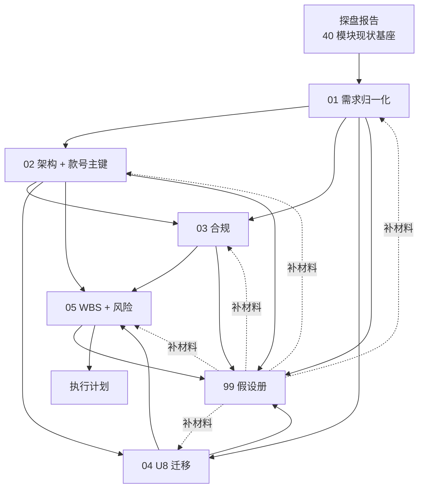

# 00 · 对日针织外贸 ERP 战略交付物总纲

> **定位**：这是 5 份战略交付物的导航 + 关键决策速览。任何想要全貌的读者从本文开始。
> **产出日**：2026-04-21 · **修订日**：2026-04-22 · **项目**：对日针织外贸 ERP（基于 RuoYi-Vue 3.9.2）
> **作者**：Claude Opus 4.7 · **版本**：v1.2

---

## 1. 五份交付物一览

| # | 文件 | 主题 | 适用读者 | 核心输出 |
| :-- | :-- | :-- | :-- | :-- |
| 01 | [需求归一化](01-requirements-normalization.md) | 消解部门冲突，划定模块边界 | 产品 / 业务 Owner | 9 大业务域、37 模块、11 冲突决策、15 遗留问题 |
| 02 | [架构 + 款号主键](02-architecture-and-key-system.md) | 技术底座 + 款号全链路 | 架构师 / 技术负责人 | 六层架构、双轨主键、7 条 ADR、编码规则 |
| 03 | [合规 + JIS + 验厂](03-compliance-and-audit.md) | 法律 + 标准 + 审计 硬约束 | 合规 / 安全 / 品质 | 30+ 硬约束、PIPL / APPI / JIS / WRAP 映射 |
| 04 | [U8 对标 + 迁移](04-u8-migration-plan.md) | 存量数据迁移与集成 | 财务 / 架构 / PM | 场景 A 推荐、字段映射、切换策略、对账方案 |
| 05 | [WBS + 风险](05-wbs-and-risk.md) | 全周期计划与风险预案 | PM / 决策层 | 70+ 工作包、40+ 风险、9 个月路线、173 万预算 |
| 99 | [假设登记册](99-assumptions.md) | 所有未校正假设的统一登记 | 业务 Owner / 决策层 | 40+ 假设、校正路径 |

---

## 2. 五份交付物的关系图

**阅读顺序建议**：
- 决策层：00 → 05 → 99
- 架构师：01 → 02 → 03 → 04
- 产品经理：01 → 04 → 05
- 合规 / 品质：03 → 01（§3.2）

---

## 3. 项目核心状态快照

### 3.1 现状（基于 2026-04-21 探盘）

| 维度 | 状态 |
| :-- | :-- |
| 前期开发（P0-P2） | **100% 完成**（31 天，11 Domain + 43 测试） |
| 前端模块 | 40 个（归一化后 37 个） |
| 技术栈 | RuoYi 3.9.2 + Spring Boot 4.0.3 + MySQL 5.7 + Redis + Flowable + Vue 2.6 + Element UI |
| Git 活跃度 | 最近 2 个月 7 次提交（低） |
| **关键缺口** | 款号命名不统一、i18n 仅中文、敏感数据未脱敏、行级权限未验证、U8 未集成、前端测试为零 |

### 3.2 目标（9 个月后 · 2027-01 左右）

- 全量工厂切换完成、U8 业务停写
- 合规审计通过（PIPL 标准合同备案 + 客户验厂）
- 多工厂行级权限生效
- 中日英三语 UI
- 对账差异稳定 < 0.01%
- 年运维态进入

---

## 4. 20 条关键决策速查

### 架构类（8 条）

| # | 决策 | 出处 |
| :-- | :-- | :-- |
| 1 | 沿用 Spring Security + JWT，不引第三方鉴权 | 02 ADR-001 |
| 2 | 单库软隔离（factory_id），未来 5+ 厂再分库 | 02 ADR-002 |
| 3 | Flowable 继续用，不替换 | 02 ADR-003 |
| 4 | Vue 2 一期保留，二期 2026Q4 切 Vue 3 | 02 ADR-004 |
| 5 | 款号主键双轨：`id` 技术 + `style_code` 业务 | 02 ADR-005 |
| 6 | 不引入独立 API Gateway | 02 ADR-006 |
| 7 | 不引入 Seata，事务分级治理 | 02 ADR-007 |
| 8 | ArchUnit 作为架构守护（P3 末引入）| 02 §4、05 P3.6 |

### 业务类（6 条）

| # | 决策 | 出处 |
| :-- | :-- | :-- |
| 9 | 款号字段统一 `styleCode`，废弃 `styleNo` | 01 C01、02 ADR-005 |
| 10 | 订单三级粒度：SO 头 → 行（款）→ 项（色×码）| 01 C02 |
| 11 | BOM 多级（纱→坯→成衣）| 01 RN-003、05 P5.1 |
| 12 | 计件工资 = 完工 ∧ 质检合格 | 01 C08 |
| 13 | 色卡归品质部维护，工艺只读 | 01 C05 |
| 14 | 改单阈值：金额 > 10% 或数量 > 5% 重审 | 01 C10、RN-007 |

### 合规类（3 条）

| # | 决策 | 出处 |
| :-- | :-- | :-- |
| 15 | 敏感字段（身份证 / 手机 / 银行卡）加密 + 脱敏 | 03 §1.1.2 |
| 16 | PIPL 第 38 条走"标准合同备案" | 03 §1.1.3 |
| 17 | Flowable 审批全留痕（history=full）| 03 §7 |

### 交付类（3 条）

| # | 决策 | 出处 |
| :-- | :-- | :-- |
| 18 | U8 保留做账（场景 A），业务全迁 RuoYi | 04 §3.3 |
| 19 | 迁移用 Phased + Pilot 组合策略 | 04 §5.2 |
| 20 | 切换窗口锁定 11-12 月（避开季节高峰）| 05 B04 |

---

## 5. 高优先级遗留问题汇总（40+ 条中的 🔴 P0 子集）

> **本节是与业务 Owner 开会时的议程模板。** 每条都要在一周内获得明确回答。

### 5.1 业务与产品（8 条）

| ID | 问题 | 来源 |
| :-- | :-- | :-- |
| RN-001 | 款号字段统一为 `styleCode`？ | 01 |
| RN-002 | 订单号编码规则（格式、工厂嵌入否）| 01 |
| RN-003 | BOM 多级确认（纱→坯→成衣）| 01 |
| RN-005 | Demo 前缀 Domain（11 个类）是否保留 | 01 |
| AR-006 | 款号升版时在产工单处理规则 | 02 |
| WR-004 | Pilot 工厂选谁 | 05 |
| WR-005 | 接受场景 A（U8 保留做账）？ | 05 |
| B05 | 款号编码被业务拒绝的风险 | 05 |

### 5.2 合规与安全（7 条）

| ID | 问题 | 来源 |
| :-- | :-- | :-- |
| CO-001 | 日方客户 CoC/RSL 文件是否可提供 | 03 |
| CO-002 | PIPL 标准合同是否签署 | 03 |
| CO-007 | 验厂体系优先级（WRAP / BSCI / 客户自有）| 03 |
| AR-005 | 大文件（样品图、色卡）存储方案 | 02 |
| C01 | PIPL 备案未完成前限制出境数据 | 05 |
| C04 | 客户验厂失败的 30 天整改预案 | 05 |
| CO-006 | 人脸数据(`sys_user.facedata`)迁入 or 废弃 | 10 §4.1 |
| C06 | 等保测评级别（二级 / 三级）| 05 |

### 5.3 U8 与迁移（6 条）

| ID | 问题 | 来源 |
| :-- | :-- | :-- |
| U8-001 | U8 版本号与账套信息 | 04 |
| U8-002 | U8 当前使用哪些模块 | 04 |
| U8-003 | U8 存货核算方法 | 04 |
| U8-004 | 场景 A or B | 04 |
| U8-005 | U8 EAI 接口是否可用 | 04 |
| T04 | U8 EAI 不稳定的 POC 前置 | 05 |

### 5.4 资源与治理（4 条）

| ID | 问题 | 来源 |
| :-- | :-- | :-- |
| WR-001 | 9 个月工期接受否 | 05 |
| WR-002 | 173 万预算落实否 | 05 |
| WR-003 | 8 人团队能否到位 | 05 |
| D01 | 关键路径人力不足的备用外包 | 05 |

### 5.5 总计

- 🔴 P0：25 条（本周必须决策）
- 🟡 P1：约 20 条（1 个月内决策）
- 🟢 P2：约 15 条（上线后迭代）

---

## 6. 下一步行动（本周）

### 6.1 业务 Owner

1. **读本文档 + 01 §9 + 05 §4** → 准备决策会议议程
2. **召集决策会议**（业务、生产、财务、品质 总监级别）
3. **30 分钟通读 `04 §0` 的 A1-A6 假设** → 联合财务校正

### 6.2 技术负责人

1. **读 02 整份 + 03 §6 硬约束 + 05 §1.2 WBS**
2. **组建核心团队**：架构师 1 + 后端高级 2 + 前端 1 + QA 1
3. **搭建工程基础设施**：Git 仓库、CI/CD、Jira、Confluence
4. **启动 P3.1 款号命名统一的技术方案评审**

### 6.3 PM

1. **把 05 §1 WBS 导入 Jira**
2. **建立 05 §8 的会议节律**
3. **发起首次风险登记册维护（05 §4）**
4. **与 HR / 财务对齐 05 §3 预算**

### 6.4 合规负责人

1. **读 03 整份**
2. **联系法务确认 PIPL 标准合同备案进度**
3. **盘点现有客户 CoC / RSL 文件**
4. **预约等保测评机构**

---

## 7. 成功标准（上线后 3 个月评估）

| 维度 | 衡量指标 | 目标 |
| :-- | :-- | :-- |
| **业务连续性** | 生产 P0 事故 | 0 次 |
| **数据准确性** | 库存 / 销售月度对账差异 | < 0.01% |
| **系统可用性** | 全年 SLA | ≥ 99.5% |
| **性能** | API 平均响应 | ≤ 500 ms |
| **用户满意度** | 业务用户调研 | ≥ 80% |
| **合规审计** | 客户验厂首次通过率 | ≥ 80% |
| **投资回报** | 首年业务收益 | ≥ 110 万（符合前期预算） |

---

## 8. 文档维护规则

### 8.1 变更流程

1. **小修订（错别字、链接）**：PM 直接改，邮件通知
2. **中修订（新增章节、调整决策）**：更新版本号（v1.0 → v1.1），CCB 签字
3. **大修订（架构级调整）**：召开 CCB 评审会，形成会议纪要，更新主版本（v1.x → v2.0）

### 8.2 假设校正流程

1. 获取新的输入材料（U8 schema、客户 CoC 等）
2. 更新 `99-assumptions.md` 对应条目为"已校正"
3. 如假设与实际冲突：更新相关交付物（01-05）并在变更日志中记录
4. CCB 评审影响范围

### 8.3 版本化

- 所有文档放入 Git：`D:/erp/docs/` 目录
- 每次变更 commit message 必须包含：`docs: [文档编号] 变更摘要`
- 里程碑（MS1/MS2/...）完成时冻结版本（git tag）

---

## 9. 文档索引与交叉引用

| 主题 | 主文档 | 相关章节 |
| :-- | :-- | :-- |
| 款号主键 | 02 | 02 §2、01 RN-001、03 §4、04 §6 |
| 行级权限 | 02 §6 | 05 P3.3、03 §6.2 |
| i18n 多语言 | 01 RN / 02 §5 | 03 §2.2、05 P3.4 |
| Flowable 审批 | 02 ADR-003 | 03 §7、01 §4 |
| 数据出境 | 03 §1.1.3 | 04 §4、05 C01 |
| 合规 Checklist | 03 §6 | 05 P4.1 |
| U8 集成 | 04 §4 | 05 P4.2-4.5 |
| 存货核算 | 04 §2 | 05 P5.2 |
| 验厂应对 | 03 §5 | 05 C04 |
| 风险登记 | 05 §4 | 00 §5 |
| 关键路径 | 05 §2.2 | 00 §3 |

---

## 10. 文档字数与覆盖度汇总

| 文档 | 字数 | 表格 | Mermaid | 关键产出 |
| :-- | :-- | :-- | :-- | :-- |
| 01 | ~5200 | 9 | 3 | 9 业务域、37 模块、15 遗留问题 |
| 02 | ~5600 | 18 | 2 | 7 ADR、双轨主键、6 层架构 |
| 03 | ~5400 | 26 | 0 | 30+ 硬约束、8 假设 |
| 04 | ~5500 | 22 | 2 | 场景 A、18 工作包、10 字段映射 |
| 05 | ~5600 | 27 | 2 | 70+ 工作包、40+ 风险、9 个月路线 |
| 00 | ~2500 | 7 | 1 | 20 决策速查 |
| 99 | ~2800 | 1 大表 | 0 | 40+ 假设登记 |
| **合计** | **~32600** | **110** | **10** | **全景战略** |

---

**阅读推荐**：
- **如果只有 15 分钟**：读本文档 + 01 §9 + 05 §4
- **如果只有 1 小时**：读本文档 + 01 全 + 05 §1.1/§4
- **要做决策**：读 00 §4、§5、§6
- **要开始开发**：读 02 全 + 05 §1

**下一步动作**：基于本文 §6 的 4 个行动项，本周启动。

---

## 变更日志

- **2026-04-22 v1.2**:同步 `docs/10` 发现。§5.2 合规与安全 P0 清单新增 CO-006 "人脸数据(`sys_user.facedata`)迁入 or 废弃"决策点。来源:富泉历史库 PDF 2019 年导出含该字段,属 PIPL 第 28 条敏感信息。
- **2026-04-22 v1.1**：同步 02 ADR-001 事实校正。§4 架构类决策第 1 行由
  "保留 Apache Shiro，不切 Spring Security" 改为 "沿用 Spring Security + JWT，不引第三方鉴权"。
  理由详见 `02-architecture-and-key-system.md` ADR-001 与变更日志。
