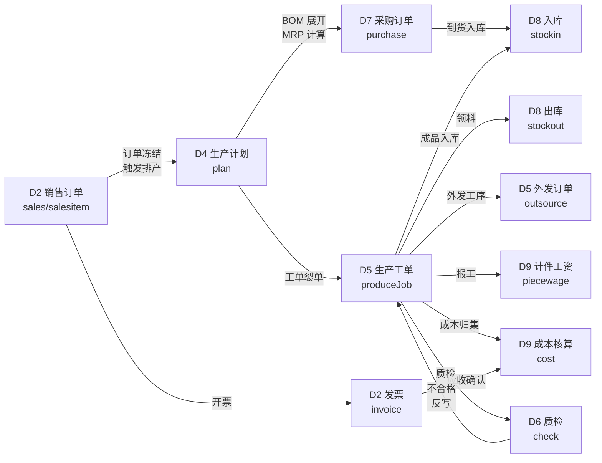
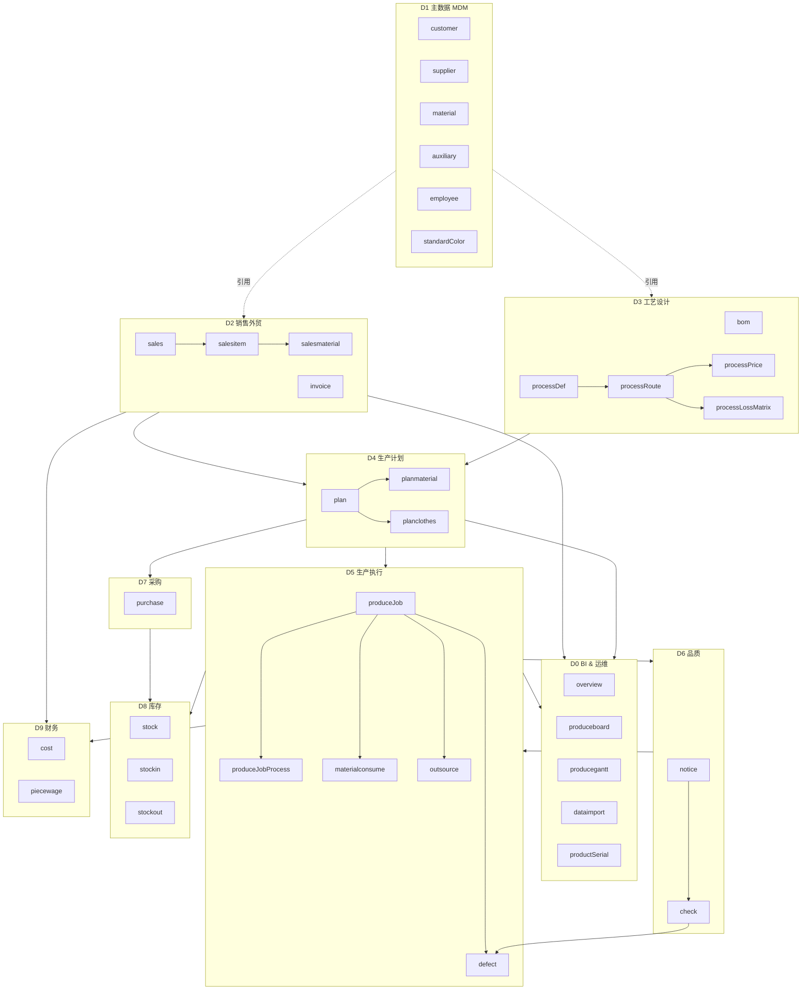

# 交付物 01：顶层需求归一化与模块边界

> **定位**：消解多部门需求冲突，锚定 40 个模块的业务边界、跨域接口和归属决策。
> **产出日**：2026-04-21 · **项目**：对日针织外贸 ERP（基于 RuoYi-Vue 3.9.2）
> **状态**：v1.0 初版（基于现有代码 + 5 份前期分析文档 + 行业通识）

---

## 0. 文档如何使用

| 你的角色 | 应该先看 |
| :-- | :-- |
| 业务 Owner（外贸/生产老板） | §2 业务上下文 → §5 九大业务域 → §9 遗留问题登记册 |
| 产品经理 | §3 多部门诉求矩阵 → §4 冲突决策表 → §7 跨模块接口清单 |
| 架构师 | §5 业务域划分 → §6 模块归并表 → §8 模块边界图 → 跳转 `02-architecture-and-key-system.md` |
| 开发负责人 | §6 模块归并表 → §7 接口清单 → §9 遗留问题 |
| QA/实施 | §3 部门诉求 → §9 遗留问题登记册 |

---

## 1. 归一化的目标与非目标

### 目标

1. **语义统一**：把"订单/款号/工单/物料"等高频词的部门方言收敛到一套词典。
2. **边界清晰**：每个业务动作只在一个模块中落单据，避免跨模块"同事件双记账"。
3. **冲突前置暴露**：把隐含在需求阶段的部门分歧显式化、写进决策表。
4. **为架构服务**：归一化产物直接喂给 `02-architecture-and-key-system.md`，作为模块划分依据。

### 非目标

- ❌ 不做字段级 DDL 设计（归 `02` 负责）。
- ❌ 不做合规与审计规则（归 `03`）。
- ❌ 不做任务拆解与排期（归 `05`）。

---

## 2. 业务上下文锚定

### 2.1 行业特性（针织外贸）

【事实 + 行业通识】对日针织外贸业务的 6 个硬特征，直接决定模块划分和数据结构：

| 特征 | 含义 | 对 ERP 的要求 |
| :-- | :-- | :-- |
| **三级 BOM** | 纱线（Yarn）→ 坯布（Greige）→ 成衣（Garment） | BOM 必须支持三级结构，物料类型需细分；**现有 `bom` 模块单级 BOM 不够** |
| **颜色 × 尺码双维度** | 每个款号按 Color × Size 发货，单独入库 | SKU = 款号 + 颜色 + 尺码；**现有 `add_produceplan_columns.py` 后补颜色/尺码字段，说明初期未规划** |
| **小批量多款** | 一张订单 5-20 款，每款数百件 | 订单主从结构必须高效；生产工单按款 + 颜色裂开 |
| **客户签样强制** | 每款头样必须经日方客户书面确认才可大货生产 | **现有 `sample_notice.color_confirm_status` 已覆盖，但缺电子签章合法性记录**（见 `03`） |
| **色差敏感** | Delta-E 色差 ≤ 客户容差才合格 | **现有 `standardColor.default_delta_e` 已设计，但缺分级规则**（ΔE1.0/2.0/3.0） |
| **季节交期** | 春夏秋冬四季订单，交期 "提前 90 天下单、提前 14 天交货" | 排程引擎必须支持交期倒推；**现有 `producegantt` 甘特图已就位** |

### 2.2 企业现状推测

【推测】基于前期论证报告（《ERP项目论证报告.md》20 万投入、110 万年收益、2-3 个工厂）：

- **工厂数**：2-3 个，自产 + 外协混合
- **人员规模**：产线工人 ~200，管理 ~30，合计 ~230
- **客户结构**：日方品牌客户为主（~5-10 个），兼少量内销
- **月单量**：50-100 款，对应 SKU 200-500 条
- **年营收区间**：推测 5000 万-2 亿人民币

### 2.3 当前代码实现摸底（来自探盘报告）

| 维度 | 现状 | 备注 |
| :-- | :-- | :-- |
| 前端模块数 | 40 个 | 覆盖基础、销售、工艺、计划、生产、品质、采购、库存、财务、看板 |
| 后端 Domain | 11 个完整 Domain 类（Demo 前缀） + 40+ 业务 Controller | **Demo 前缀可能是测试残留，需评审** |
| 数据库表 | `t_erp_*` 前缀，已覆盖 40+ 张业务表 | 字符集 utf8mb4 |
| 多工厂 | `factory_id` 软隔离字段存在 | 行级权限拦截器待验证 |
| 工作流 | Flowable 已集成 | 流程监听器缺失 |

---

## 3. 多部门诉求矩阵

### 3.1 10 个干系部门的核心动词

【事实 + 通识】基于业务流程推演，每个部门的关键动词、KPI 和对应现有模块：

| 部门 | 核心动词 | 关键 KPI | 对应现有模块 | 完成度 |
| :-- | :-- | :-- | :-- | :-- |
| **外贸业务部** | 报价、下单、跟单、单证 | 订单准时率、毛利率 | `sales`、`salesitem`、`salesmaterial`、`customer`、`contacts`、`invoice` | 通 |
| **工艺部** | 建款、BOM、工艺路线、损耗、工价 | 工艺齐套率、损耗控制 | `bom`、`processDef`、`processRoute`、`processRouteItem`、`processPrice`、`processLossMatrix`、`tech` | 通（部分骨架） |
| **生产计划部** | 排产、裂单、物料需求计算 | 交期准时率、排产饱和度 | `plan`、`planmaterial`、`planclothes` | 通 |
| **生产执行部** | 派工、报工、报缺、领料、外发 | 工单完成率、WIP | `produceJob`、`produceJobProcess`、`materialconsume`、`outsource`、`defect` | 通 |
| **品质部** | 对样、色差、AQL 抽检、客诉 | 一次合格率、客诉率 | `notice`、`check`、`defect`、`standardColor` | 半通（电签缺） |
| **采购部** | 询价、PO、到货、对账 | 准时到货率、采购成本 | `purchase`、`supplier`、`material`、`auxiliary` | 通 |
| **仓储部** | 入库、出库、调拨、盘点 | 库存准确率、周转天数 | `stock`、`stockin`、`stockout` | 通 |
| **财务部** | 核算、应收应付、开票、成本 | 毛利、现金回收期 | `cost`、`invoice`、`piecewage` | 半通（应收应付模型弱） |
| **人事部** | 员工档案、计件工资 | 工资正确率 | `employee`、`piecewage` | 通 |
| **管理层/IT** | 看板、报表、导入、追溯 | 数据时效、决策支持 | `overview`、`produceboard`、`producegantt`、`dataimport`、`productSerial` | 通 |

### 3.2 部门间共享视图与专属视图

【原则】避免"每个部门自建表"——采用 **中央化数据 + 视图化权限**。

```
        ┌────────────────────────────────────────┐
        │       中央主数据（MDM）层               │
        │  客户、供应商、物料、款号、色号、员工      │
        └────────────────────────────────────────┘
                        ↓ 引用
        ┌────────────────────────────────────────┐
        │        中央业务单据层                    │
        │  销售订单、采购订单、工单、入库、出库      │
        └────────────────────────────────────────┘
                        ↓ 过滤
    ┌─────────┬──────────┬─────────┬─────────┐
    │ 业务视角  │ 生产视角  │ 财务视角  │ 品质视角  │
    │ 按客户   │ 按工单    │ 按发票    │ 按检验单  │
    └─────────┴──────────┴─────────┴─────────┘
```

---

## 4. 需求冲突矩阵与决策表

### 4.1 典型冲突清单（11 条）

| # | 冲突类型 | 部门 A | 部门 B | 冲突点 | 严重度 |
| :-- | :-- | :-- | :-- | :-- | :-- |
| C01 | 命名 | 业务 | 工艺 | "款号"字段叫 `styleNo` 还是 `styleCode` | 🔴 高 |
| C02 | 粒度 | 业务 | 生产 | "订单"=SO 总单 / 一款一单 / 按颜色一单 | 🔴 高 |
| C03 | 粒度 | 业务 | 财务 | "发票"=一张订单一票 / 可合并多单开票 | 🟡 中 |
| C04 | 时序 | 业务 | 工艺 | 下单即锁工艺 vs 下单后工艺可调 | 🟡 中 |
| C05 | 归属 | 品质 | 工艺 | 色卡（StandardColor）归谁维护 | 🟡 中 |
| C06 | 归属 | 业务 | 外贸单证 | 发票、箱单、装箱单归谁开具 | 🟡 中 |
| C07 | 数据一致性 | 生产 | 仓储 | 工单领料出库时点 | 🔴 高 |
| C08 | 数据一致性 | 生产 | 财务 | 计件工资的"完工口径" | 🟡 中 |
| C09 | 跨厂数据 | 管理 | 工厂 | 总部能否越权查看工厂明细 | 🔴 高 |
| C10 | 审批链 | 业务 | 生产 | 客户改单后的重新审批规则 | 🟡 中 |
| C11 | 语言 | 业务 | 生产 | 日方客户查询界面语言 | 🔴 高 |

### 4.2 冲突消解决策表

| ID | 决策 | 理由 | 影响模块 | 决策人 |
| :-- | :-- | :-- | :-- | :-- |
| C01 | **统一为 `styleCode`**（字符串，业务语义明确） | `Code` 后缀比 `No` 更准确反映"业务主键"属性；与 `materialCode`、`customerCode` 对齐 | 所有业务表、Domain、前端 v-model | 架构师 |
| C02 | **三级粒度共存**：SO 订单头 → SO 行（款）→ SO 行项目（颜色×尺码），生产工单从 SO 行裂单 | 外贸习惯按整单报价，生产必须按款-色拆单 | `sales`、`salesitem`、`salesmaterial`、`produceJob` | 产品经理 |
| C03 | **支持"一对一"与"多对一"两种开票**，发票主表带 `invoiceType`（01 单单开票 / 02 合并开票） | 日方客户常要求月结合并开票 | `invoice` | 财务 + 产品 |
| C04 | **下单即锁工艺快照**，后续改单必须重走"工艺确认"子流程 | 保证工单执行期间工艺不被业务静默改动 | `sales`、`tech` + Flowable 监听 | 工艺主管 |
| C05 | **色卡归品质部维护，工艺部只读引用** | 色差最终检测标准由品质把关 | `standardColor` | 品质经理 |
| C06 | **业务部开具、财务部复核** | 外贸单证业务属性强，但入账必须财务签核 | `invoice` + Flowable 审批链 | 外贸经理 |
| C07 | **领料即出库**：工单领料事件同步生成出库单，事务一致 | 避免"领了没扣库存"的账实不符 | `produceJob` + `stockout` + 事务 | 架构师 |
| C08 | **计件工资按"工序完工 + 质检通过"双确认** | 防止次品也计件 | `piecewage` + `check` | 生产 + HR |
| C09 | **总部可查所有工厂，工厂只可查自己** | 通过 `factory_id` 行级权限 + 角色 `data_scope` 实现（详见 `02`） | 全局拦截器 | 架构师 |
| C10 | **改单金额 > 10% 或数量 > 5% 必须重走销售审批流** | 保护毛利与交期承诺 | `sales` + Flowable | 产品 + 业务 |
| C11 | **UI 多语言切换（中/日/英），业务数据自动附中日双语** | 款名、物料名、颜色名需中日双填 | 全局 i18n + 主数据表 `xxx_name_ja` 字段 | 架构师（见 `03`） |

---

## 5. 九大业务域划分（归一化结果）

把 40 个现有模块收敛为 9 个业务域 + 1 个共享能力域，避免"按部门建模块"的低效分工。

| 域编号 | 业务域 | 所含模块 | 归并理由 | 主负责方 |
| :-- | :-- | :-- | :-- | :-- |
| **D1** | 主数据（MDM） | customer, supplier, material, auxiliary, employee, standardColor, contacts | 所有引用型实体统一治理，避免多口径 | 管理层直属 |
| **D2** | 销售外贸 | sales, salesitem, salesmaterial, invoice | SO 主从 + 开票一条线 | 外贸业务部 |
| **D3** | 工艺设计 | bom, processDef, processRoute, processRouteItem, processPrice, processLossMatrix, tech | 款号的"工艺骨架"，下游生产/成本全依赖 | 工艺部 |
| **D4** | 生产计划 | plan, planmaterial, planclothes | 从 SO 到工单的"排程中枢" | 生产计划部 |
| **D5** | 生产执行 | produceJob, produceJobProcess, materialconsume, outsource, defect | 车间实际落地层 | 生产执行部 |
| **D6** | 品质管理 | notice（样品通知）, check（质检）, defect（缺陷）| 贯穿对样-头样-大货三阶段 | 品质部 |
| **D7** | 采购供应 | purchase | 从 MRP 到入库 | 采购部 |
| **D8** | 库存管理 | stock, stockin, stockout | 仓储三件套 | 仓储部 |
| **D9** | 财务核算 | cost, piecewage | 成本与工资 | 财务部 + HR |
| **D0** | BI/运维 | overview, produceboard, producegantt, dataimport, productSerial | 管理视图 + 数据治理 | IT / 管理层 |

### 归并后的"冗余模块"待评审

| 模块 | 问题 | 建议 |
| :-- | :-- | :-- |
| `processRoute` 与 `processRouteItem` | 同名主从，前端可合并为一个页面主从结构 | 合并 UI，保留后端双表 |
| `processPrice` 与 `processRoute` | processPrice 可能是 processRoute 的定价字段 | 评审是否归并 |
| `notice` 与 `tech` | 样品通知含工艺信息，与 `tech` 可能重叠 | 确认边界 |
| Demo 前缀 Domain（DemoOrder, DemoStyle 等） | 疑似测试残留，有 BigDecimal + 43 个单测 | **确认是否正式版**，若否则删除避免混淆 |

---

## 6. 模块归并总表

合并前后模块对照：

| 原模块 | 归并后域 | 角色 | 是否保留独立 Controller |
| :-- | :-- | :-- | :-- |
| customer | D1 | 客户档案 | 是 |
| supplier | D1 | 供应商档案 | 是 |
| material | D1 | 主物料档案 | 是 |
| auxiliary | D1 | 辅料档案 | 是 |
| employee | D1 | 员工档案 | 是 |
| standardColor | D1 | 标准色卡 | 是 |
| contacts | D1 | 客户联系人 | 合并入 customer 页面的子Tab |
| sales | D2 | SO 头 | 是 |
| salesitem | D2 | SO 行（款） | 是 |
| salesmaterial | D2 | SO 行明细（色×码） | 是 |
| invoice | D2 | 发票 | 是 |
| bom | D3 | 物料清单（多级） | 是 |
| processDef | D3 | 工序定义 | 是 |
| processRoute | D3 | 工艺路线 | 是 |
| processRouteItem | D3 | 路线明细 | **合并入 processRoute** |
| processPrice | D3 | 工序工价 | 是 |
| processLossMatrix | D3 | 损耗矩阵 | 是 |
| tech | D3 | 款式工艺 | 评审：若与 notice 重叠则合并 |
| plan | D4 | 生产计划 | 是 |
| planmaterial | D4 | 计划物料 | 是 |
| planclothes | D4 | 计划衣片 | 是 |
| produceJob | D5 | 生产工单 | 是 |
| produceJobProcess | D5 | 工单工序 | 是 |
| materialconsume | D5 | 物料消耗 | 是 |
| outsource | D5 | 外发订单 | 是 |
| defect | D5/D6 | 缺陷记录 | 是 |
| notice | D6 | 样品通知 | 是 |
| check | D6 | 质检记录 | 是 |
| purchase | D7 | 采购订单 | 是 |
| stock | D8 | 库存查询 | 是 |
| stockin | D8 | 入库单 | 是 |
| stockout | D8 | 出库单 | 是 |
| cost | D9 | 成本核算 | 是 |
| piecewage | D9 | 计件工资 | 是 |
| overview | D0 | 生产概览 | 是 |
| produceboard | D0 | 生产看板 | 是 |
| producegantt | D0 | 甘特图 | 是 |
| dataimport | D0 | 数据导入工具 | 是 |
| productSerial | D0 | 产品序列号 | 是 |

合并后有效模块数：**37 个**（从 40 → 37，合并了 contacts、processRouteItem、tech 三项）。

---

## 7. 跨模块接口清单（关键业务流）

### 7.1 主干业务流（"接单到收款"端到端）



### 7.2 关键跨域接口规格（预定义契约）

| 接口编号 | 上游 → 下游 | 触发事件 | 传输内容 | 幂等要求 |
| :-- | :-- | :-- | :-- | :-- |
| I01 | sales → plan | SO 审批通过 | SO 头 + 所有行 + 款号快照 | 是 |
| I02 | plan → purchase | MRP 计算完成 | 物料需求清单（物料+数量+到料日期） | 是 |
| I03 | plan → produceJob | 计划下达 | 工单清单（款+色+数量+工艺路线快照） | 是 |
| I04 | produceJob → stockout | 领料请求 | 出库单（物料+数量+工单号） | 是 |
| I05 | produceJob → outsource | 外发工序 | 外发单（工序+数量+外协厂） | 是 |
| I06 | outsource → stockin | 外发回厂 | 入库单（成品/半成品） | 是 |
| I07 | produceJob → check | 工序完工 | 质检触发（按抽检规则） | 否（多次检） |
| I08 | check → produceJob | 质检结果 | 合格/返工/报废 | 是 |
| I09 | produceJob → piecewage | 工序完工 + 质检合格 | 计件记录（员工+工序+数量+单价） | 是 |
| I10 | produceJob → cost | 工单完工 | 料工费归集（直材+直人+制费） | 是 |
| I11 | sales → invoice | 发货/月结 | 发票草稿（可手动合并） | 否 |
| I12 | invoice → cost | 发票确认 | 应收金额 | 是 |

### 7.3 接口实现建议

【原则】**事件驱动 + 异步解耦**，避免同步强依赖：

- 高一致性场景（I04 领料出库）：**同一事务** + 事务传播
- 一般场景（I01、I03）：**Spring Event + 异步监听** + 失败重试
- 跨工厂场景（未来）：**Flowable 子流程** + 消息队列

---

## 8. 模块边界图（全景）



---

## 9. 遗留问题登记册

> **这是本文档最重要的输出之一。** 每个条目都需要在后续阶段获得业务 Owner 的明确回答；未回答前，默认采用"默认决策"推进，但需在上线前复核。

| ID | 问题 | 类型 | 默认决策 | 待询问对象 | 影响 | 紧迫度 |
| :-- | :-- | :-- | :-- | :-- | :-- | :-- |
| RN-001 | 款号命名 `styleNo` vs `styleCode` | 字段 | 统一为 `styleCode` | 架构师确认 | 全库重构 | 🔴 P0 |
| RN-002 | 订单号编码规则（是否含年份、工厂、客户简码） | 编码 | `SO-YYYY-FAC-SEQ6`（如 `SO-2026-SH-000123`） | 业务 Owner | 全局 | 🔴 P0 |
| RN-003 | BOM 级数：单级 vs 多级（纱→坯→成衣） | 模型 | 多级（3 层）| 工艺主管 | bom 表重构 | 🔴 P0 |
| RN-004 | 颜色/尺码是否作为独立主数据 | 模型 | 颜色独立主数据（已有 standardColor），尺码配置化字典 | 工艺/品质 | 多表字段 | 🟡 P1 |
| RN-005 | Demo 前缀的 Domain（DemoOrder 等）是否正式 | 代码 | 评审后决定：删除或改名 | 架构师 | 11 个类 | 🔴 P0 |
| RN-006 | 发票合并开票规则（按月？按客户？） | 业务 | 发票主表 `invoiceType` 支持两种 | 财务经理 | invoice | 🟡 P1 |
| RN-007 | 改单阈值（金额/数量变动多少需重审） | 业务 | 金额 > 10% 或数量 > 5% | 业务经理 | sales 流程 | 🟡 P1 |
| RN-008 | 外协工序完工验收口径 | 业务 | 外协厂入库 = 完工；质检独立记录 | 生产经理 | outsource | 🟡 P1 |
| RN-009 | 计件工资的质检门禁（质检不过是否扣减） | 业务 | 扣减：工序完工 ∧ 质检合格 才计件 | HR/生产 | piecewage | 🟡 P1 |
| RN-010 | 多工厂之间调拨规则 | 业务 | 需设计调拨单（未包含在现有 40 模块中） | 仓储经理 | 新增模块 | 🟢 P2 |
| RN-011 | 客户对日报价的币种与汇率 | 业务 | 报价支持 JPY/CNY/USD，汇率按下单日锁定 | 财务 | invoice/cost | 🟡 P1 |
| RN-012 | 日方客户是否需要登录查询 | 业务 | 预留客户门户，一期不上 | 业务 Owner | 架构 | 🟢 P2 |
| RN-013 | 季节订单归档策略（过季订单只读） | 业务 | 交货后 90 天置为只读 | 业务 Owner | 全局 | 🟢 P2 |
| RN-014 | `tech` 模块与 `notice` 的边界 | 模块 | 评审是否合并 | 工艺/品质 | 模块数 | 🟢 P2 |
| RN-015 | ERP-UI-2（Gemini AI Studio）的定位 | 项目 | 评审：保留试验 / 并入主项目 / 废弃 | 架构师 | 项目范围 | 🟡 P1 |

**紧迫度说明**：
- 🔴 **P0**：上线前必须确认，否则数据结构无法稳定
- 🟡 **P1**：上线前应确认，否则影响业务流程流畅度
- 🟢 **P2**：上线后可迭代

---

## 10. 下一步联动

1. 本文档 §4（决策表）与 §5（业务域）直接喂给 **`02-architecture-and-key-system.md`**，作为架构分层和款号主键设计的输入。
2. 本文档 §9（遗留问题）的 P0 条目需要在一周内召集业务 Owner 会议消解。
3. 本文档 §3.2（数据共享）将在 **`03-compliance-and-audit.md`** 展开为行级权限与审计规则。
4. 本文档 §6（模块归并）将在 **`05-wbs-and-risk.md`** 拆解为具体迁移工作包。

---

**关联交付物**：`02-architecture` · `03-compliance` · `04-u8-migration` · `05-wbs-risk` · `99-assumptions`
**本文档字数**：约 5200 字 | **图表数**：3 张 mermaid + 9 张表格
