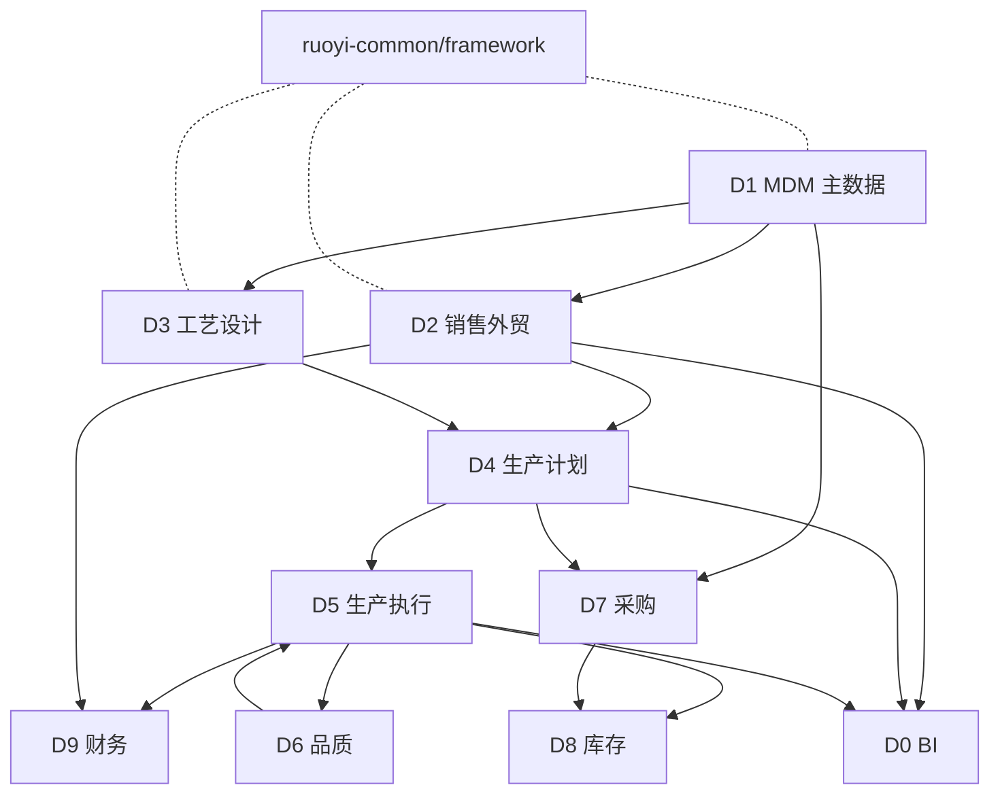

# 交付物 02：全局架构纲领 + 款号全链路主键体系

> **定位**：建立技术架构的底座决策与款号主键体系，让所有模块的开发有统一"骨架可依"。
> **产出日**：2026-04-21 · **修订日**：2026-04-22 · **项目**：对日针织外贸 ERP
> **状态**：v1.1（ADR-001 事实校正）
> **前置阅读**：`01-requirements-normalization.md`（尤其是 §5 业务域、§7 接口清单）

---

## 0. 决策速览（高管 1 分钟）

| 决策点 | 结论 | 理由 |
| :-- | :-- | :-- |
| **架构形态** | 单体分模块（RuoYi 原生分层）+ 预留领域切分 | 企业规模 2-3 工厂，微服务过重 |
| **技术栈** | Spring Boot 4.0.3 + MyBatis + Spring Security + JWT + MySQL 5.7 + Redis + Flowable + Vue 2.6 + Element UI | 沿用现有（前期已投入 31 天 P0-P2 开发） |
| **前端迁移** | **一期保留 Vue 2，二期 2026Q4 切 Vue 3** | 避免推倒重来，同步打业务价值 |
| **主键策略** | **双轨制**：技术主键 `id BIGINT` + 业务主键 `styleCode VARCHAR(32)` | 满足"稳定关联"+"业务可读" |
| **款号编码** | `YYYY-SS-TT-CCC-NNNN`（年-季-品类-客户-序号）| 自解释，支持跨系统对接 |
| **多工厂隔离** | 软隔离（`factory_id` + 行级权限拦截器） | 与现有代码兼容，扩展至 5+ 厂再拆库 |
| **数据一致性** | 关键事务用 Spring 事务 + Seata（预留），弱一致场景用 Spring Event | 避免分布式事务过度设计 |

---

## 1. 架构分层

### 1.1 六层结构（基于 RuoYi 原生分层优化）

```
┌─────────────────────────────────────────────────────┐
│ L6 接入层   Vue 2 SPA + Nginx 反代 + 静态资源 CDN     │
├─────────────────────────────────────────────────────┤
│ L5 网关层   Spring Security Filter Chain + JWT        │
│            统一鉴权 + 限流 + 审计（单体内实现，不引 Gateway）│
├─────────────────────────────────────────────────────┤
│ L4 业务层   ruoyi-system（按 9 大业务域组织包结构）    │
│            controller / service / mapper / domain     │
├─────────────────────────────────────────────────────┤
│ L3 领域层   Domain + DomainService（充血模型）         │
│            DTO/VO/BO 转换 + 业务规则封装               │
├─────────────────────────────────────────────────────┤
│ L2 公共能力 ruoyi-framework + ruoyi-common             │
│            权限/日志/异常/工具/加密/缓存/i18n          │
├─────────────────────────────────────────────────────┤
│ L1 数据层   MyBatis + MySQL 5.7 + Redis + Flowable DB │
│            Druid 连接池 + 读写分离（预留）             │
└─────────────────────────────────────────────────────┘
```

### 1.2 ruoyi-system 包结构重构

【当前】`com.ruoyi.system.*` 按技术维度（controller/service/mapper）组织，业务类散落。

【建议】按业务域二级分包：

```
com.ruoyi.system
├── mdm          // D1 主数据
│   ├── customer
│   │   ├── controller
│   │   ├── service
│   │   ├── mapper
│   │   └── domain
│   ├── supplier
│   ├── material
│   └── ...
├── sales        // D2 销售外贸
├── tech         // D3 工艺设计
├── plan         // D4 生产计划
├── produce      // D5 生产执行
├── quality      // D6 品质
├── purchase     // D7 采购
├── stock        // D8 库存
├── finance      // D9 财务
└── bi           // D0 BI/运维
```

**实施成本**：高（需重命名约 200+ 类）。**ROI**：高（后续并发开发隔离冲突）。**建议时机**：一期上线后的"零号重构"窗口。

---

## 2. 款号全链路主键体系（核心）

### 2.1 设计原则

1. **双轨制**：技术主键（给 DB 用）+ 业务主键（给人用），不混淆。
2. **编码自解释**：扫一眼能知道年份、季节、品类、客户。
3. **版本化**：改款不覆盖历史，版本号与历史表并行。
4. **全局唯一**：跨工厂、跨客户、跨年份都不能重。
5. **传播即锁定**：款号被下游单据引用后不可改编码（只能改名、改工艺）。

### 2.2 款号编码规则

格式：`YYYY-SS-TT-CCC-NNNN`（总长 20 字符，VARCHAR(32) 预留）

| 段 | 长度 | 含义 | 示例 | 取值字典 |
| :-- | :-- | :-- | :-- | :-- |
| `YYYY` | 4 | 年份 | 2026 | 实际年 |
| `SS` | 2 | 季节 | SP / SU / AU / WI | Spring/Summer/Autumn/Winter |
| `TT` | 2 | 品类 | KN / PO / SW / TS | Knit/Polo/Sweater/T-Shirt（sys_dict） |
| `CCC` | 3-4 | 客户简码 | UQ / MUJI / TOKA | 客户档案 `customer_short_code` |
| `NNNN` | 4 | 流水号 | 0001-9999 | 同客户同季内顺序 |

**合法示例**：
- `2026-SP-KN-UQ-0001`（2026 春季优衣库针织款 1）
- `2026-AU-SW-MUJI-0123`（2026 秋季无印良品毛衣款 123）

**设计取舍**：
- ❌ 不嵌入工厂代码：一款可能多厂生产
- ✅ 客户简码嵌入：外贸强客户属性，对账清晰
- ✅ 流水号按"客户-年季"组合唯一：不会跨客户冲突

### 2.3 双轨主键模型

每张与款号关联的表都有 2 个字段：

```sql
-- 款号档案表（style 档案）
CREATE TABLE t_erp_style (
    id            BIGINT       NOT NULL AUTO_INCREMENT COMMENT '技术主键（雪花/自增）',
    style_code    VARCHAR(32)  NOT NULL COMMENT '业务主键（YYYY-SS-TT-CCC-NNNN）',
    style_version INT          NOT NULL DEFAULT 1 COMMENT '版本号',
    style_name_zh VARCHAR(100) NOT NULL COMMENT '中文品名',
    style_name_ja VARCHAR(100)          COMMENT '日文品名（日方客户必填）',
    style_name_en VARCHAR(100)          COMMENT '英文品名',
    customer_id   BIGINT       NOT NULL COMMENT '客户 FK',
    season        VARCHAR(2)   NOT NULL COMMENT 'SP/SU/AU/WI',
    category_code VARCHAR(2)   NOT NULL COMMENT '品类字典',
    factory_id    BIGINT       NOT NULL COMMENT '默认工厂（可多厂生产）',
    status        CHAR(1)      NOT NULL DEFAULT '0' COMMENT '0草稿 1已确认 2冻结 3作废',
    create_by     VARCHAR(64),
    create_time   DATETIME,
    update_by     VARCHAR(64),
    update_time   DATETIME,
    remark        VARCHAR(500),
    PRIMARY KEY (id),
    UNIQUE KEY uk_style_code_version (style_code, style_version),
    KEY idx_customer (customer_id),
    KEY idx_factory  (factory_id),
    KEY idx_season   (season)
) ENGINE=InnoDB DEFAULT CHARSET=utf8mb4 COMMENT='款号主档（业务主键 style_code + 版本）';
```

### 2.4 下游表的引用规约

**规约 1**：凡引用款号的表，同时保留 `style_id`（FK）和 `style_code_snapshot`（冗余快照）。

**理由**：`style_id` 用于关联查询 + 外键约束；`style_code_snapshot` 用于审计追溯（款号即使重命名，历史记录仍可读）。

```sql
-- 例：销售订单行
CREATE TABLE t_erp_sales_order_item (
    id                    BIGINT     NOT NULL AUTO_INCREMENT,
    sales_order_id        BIGINT     NOT NULL COMMENT 'SO 头 FK',
    style_id              BIGINT     NOT NULL COMMENT '款号 FK',
    style_code_snapshot   VARCHAR(32) NOT NULL COMMENT '款号快照（下单时刻）',
    style_version_snapshot INT       NOT NULL COMMENT '款号版本快照',
    ...
    PRIMARY KEY (id),
    KEY idx_style_id (style_id),
    KEY idx_style_code_snap (style_code_snapshot)
);
```

**规约 2**：状态进入 "已确认" 后，`style_code` 与 `style_version` 不可变更；改款必须建立新版本。

### 2.5 款号版本管理

```sql
-- 款号版本变更历史
CREATE TABLE t_erp_style_version_history (
    id                BIGINT      NOT NULL AUTO_INCREMENT,
    style_id          BIGINT      NOT NULL,
    style_code        VARCHAR(32) NOT NULL,
    from_version      INT         NOT NULL,
    to_version        INT         NOT NULL,
    change_type       VARCHAR(20) NOT NULL COMMENT 'BOM_CHANGE / COLOR_CHANGE / PROCESS_CHANGE / PRICE_CHANGE',
    change_summary    VARCHAR(500),
    change_snapshot   TEXT        COMMENT '变更前后对比 JSON',
    flowable_proc_id  VARCHAR(64) COMMENT '关联 Flowable 流程实例',
    approved_by       VARCHAR(64),
    approved_time     DATETIME,
    create_by         VARCHAR(64),
    create_time       DATETIME,
    PRIMARY KEY (id),
    KEY idx_style_id (style_id)
);
```

**版本升级规则**（枚举）：

| 变更类型 | 是否升版 | 是否走审批 | 对在产工单影响 |
| :-- | :-- | :-- | :-- |
| 仅改品名（文案） | ❌ | 仅记录 | 无 |
| 改颜色清单 | ✅ 主版本+1 | 业务+品质 | 阻断未开工工单 |
| 改 BOM | ✅ 主版本+1 | 工艺+业务 | 阻断未开工工单 |
| 改工艺路线 | ✅ 次版本+1 | 工艺 | 不阻断 |
| 改工价 | ❌ | 财务 | 仅影响未结算 |

### 2.6 款号生成器（ID Worker）

```java
@Component
public class StyleCodeGenerator {

    @Resource private RedisTemplate<String, Long> redisTemplate;

    /**
     * 生成款号：YYYY-SS-TT-CCC-NNNN
     * Redis 原子递增保证并发安全
     */
    public String generate(int year, String season, String category, String customerCode) {
        String prefix = String.format("%d-%s-%s-%s", year, season, category, customerCode);
        String redisKey = "style:seq:" + prefix;
        Long seq = redisTemplate.opsForValue().increment(redisKey);
        // 首次创建设置 TTL 为 2 年（跨季节复用）
        if (seq == 1L) redisTemplate.expire(redisKey, 730, TimeUnit.DAYS);
        if (seq > 9999) throw new BusinessException("同客户同季款号超限，请检查编码规则");
        return String.format("%s-%04d", prefix, seq);
    }
}
```

**并发安全**：Redis `INCR` 原子操作。**故障恢复**：Redis 掉线时回退到 DB 查 `MAX(style_code)` + 1。

---

## 3. 模块依赖拓扑

### 3.1 领域依赖（允许方向）



### 3.2 依赖约束（硬规则）

| 规则 | 描述 | 检查方式 |
| :-- | :-- | :-- |
| R1 | **D1 MDM 不得反向依赖任何业务域** | ArchUnit + 包级 Import 扫描 |
| R2 | **业务域之间单向依赖，禁止环** | ArchUnit 检测 |
| R3 | **跨域调用只走 Service，不跨包访问 Mapper** | 包可见性 + ArchUnit |
| R4 | **Domain 不可引用 Framework 中的 Web 组件**（如 HttpServletRequest） | 代码评审 |
| R5 | **业务域间只传 DTO，不传 Entity** | 类型检查 |

**推荐工具**：引入 [ArchUnit](https://www.archunit.org/) 写架构守护单元测试，每次 CI 跑一次。

### 3.3 事件驱动的松耦合接口

对于 `01 §7.2` 列出的 12 个跨域接口，推荐分类实现：

| 接口编号 | 场景 | 实现方式 |
| :-- | :-- | :-- |
| I01 sales → plan | SO 审批通过触发排产 | Spring Event + 异步监听 |
| I02 plan → purchase | MRP 生成采购需求 | 同步调用（保证数据一致） |
| I03 plan → produceJob | 工单裂单 | 同步调用 + 批量事务 |
| I04 produceJob → stockout | 领料出库 | **同一事务** |
| I07 produceJob → check | 触发质检 | Spring Event |
| I11 sales → invoice | 开票 | 用户驱动 + Flowable 审批 |

---

## 4. 关键技术决策记录（ADR）

### ADR-001：沿用 RuoYi-Vue 原生 Spring Security + JWT，不引第三方鉴权框架

- **背景**：RuoYi-Vue 3.9.2 `master` 分支原生即为 Spring Security + JWT（`ruoyi-framework/config/SecurityConfig.java`、26 处 `org.springframework.security.*` import / 9 个文件；`ruoyi-framework/pom.xml` 无 Shiro 依赖）。初版 v1.0 基于 RuoYi 老版本印象误记为 Shiro，已校正。
- **选项**：A) 沿用 Spring Security + JWT  B) 迁 Shiro  C) 迁 Sa-Token 等第三方
- **决定**：A
- **理由**：实际代码即 Spring Security，无迁移动作；生态活跃、与 Spring Boot 4.x 原生兼容；未来 OAuth2/OIDC 扩展走 `spring-security-oauth2-client` 即可
- **后果**：
  - 密码哈希走 `BCryptPasswordEncoder`（已落地）
  - 方法级鉴权走 `@PreAuthorize`、`@Secured`（`@EnableMethodSecurity` 已开启）
  - 预留 OAuth2/OIDC 扩展位，未来对接日方 SSO 成本低
  - P3 无新增鉴权框架相关重构任务（对 WBS 5 人日收益回收）

### ADR-002：单库软隔离（factory_id），不提前做分库

- **背景**：企业规模 2-3 工厂，未来可能 5+
- **选项**：A) 软隔离 `factory_id`  B) 分库分工厂  C) Schema 级隔离
- **决定**：A（一期），B（5+ 工厂时触发）
- **理由**：2-3 厂单库性能无压力；分库复杂度高
- **触发升级条件**：
  - 单工厂日订单 > 500 OR
  - 总工厂数 ≥ 5 OR
  - 单表行数 > 1000 万
- **后果**：必须实现行级权限拦截器（见 §6）；预留 `sharding_key` 字段

### ADR-003：Flowable 替代自研审批

- **背景**：现有代码已集成 Flowable
- **选项**：A) 继续用 Flowable  B) 精简为自研 workflow  C) 替换为 Activiti
- **决定**：A
- **理由**：已投入且 Flowable 比 Activiti 更活跃
- **后果**：需补齐流程监听器（事件驱动状态字段）；需培训业务配置 BPMN

### ADR-004：前端 Vue 2 一期保留，二期切 Vue 3

- **背景**：Vue 2 官方 EOL 2023-12-31，Element UI 已不再新增特性
- **选项**：A) 一期切 Vue 3  B) 保留 Vue 2 + 后续迁移  C) 永保留
- **决定**：B（切换时机 2026Q4）
- **理由**：一期时间紧（已有 31 天投入），推倒重来风险高
- **后果**：Vue 2 运行时风险在可控期（社区仍有安全修复）
- **触发条件**：2026Q4 业务稳定后启动 Vue 3 迁移专项

### ADR-005：款号主键双轨（ID + styleCode）

- **背景**：纯业务主键（styleCode）不稳定（客户可能改码），纯数字 ID 无业务语义
- **选项**：A) 仅 ID  B) 仅 styleCode  C) 双轨
- **决定**：C
- **理由**：见 §2.1
- **后果**：下游表多一个字段（`style_code_snapshot`），但获得"业务可读 + 稳定关联"

### ADR-006：一期不引入独立 API Gateway

- **背景**：团队规模小，单体部署
- **选项**：A) 单体直接提供 API  B) 引入 Spring Cloud Gateway
- **决定**：A
- **触发升级**：微服务化时（业务域独立部署需求时）

### ADR-007：数据一致性分级策略

- **场景**：ERP 有强一致（库存）和弱一致（报表）两种需求
- **决定**：
  - 强一致：Spring 事务 + 悲观锁（如库存扣减）
  - 最终一致：Spring Event + 重试队列（如审批触发排产）
  - 不使用分布式事务（Seata）除非必要
- **后果**：降低复杂度；需保证关键业务入同一事务边界

---

## 5. 前端架构纲领

### 5.1 一期（Vue 2 保留期）

| 层 | 内容 |
| :-- | :-- |
| 路由 | `vue-router 3.x`，按业务域分 meta.domain |
| 状态 | Vuex 3.x，按模块拆 store/modules |
| 请求 | Axios 封装（`utils/request.js`），统一错误拦截 |
| UI | Element UI 2.15 |
| 国际化 | **新增 vue-i18n@8.x**（中/日/英），见 `03-compliance` |
| 权限 | v-hasPermi 指令 + 路由守卫 |
| 表格 | el-table + 封装通用分页、导出组件 |

### 5.2 二期（Vue 3 迁移期）

- 目标：`Vue 3.x + Pinia + Element Plus + Vite 5`
- 策略：**单模块试点 → 渐进替换** 而非全站重写
- 试点首选：`BI/overview` 域（依赖少、改造成本低）
- 新模块（如 U8 对账）直接 Vue 3 起步

### 5.3 UI 规范

- 列表页：固定"查询条-操作栏-表格-分页"四段式
- 表单页：支持"行内编辑 + Drawer 编辑 + 独立页编辑" 三种模式
- 日期：强制用 `date-fns` / `dayjs`，禁用 `moment.js`
- 金额：统一 `BigDecimal` 序列化为字符串，前端 `number-precision` 计算

---

## 6. 多工厂行级权限设计（关键补齐项）

### 6.1 现状差距

【事实】现有代码有 `factory_id` 字段，但**未找到行级数据权限拦截器的实现**（Explore 报告 §五）。这是一个高危缺口——跨工厂数据可能互相泄露。

### 6.2 设计方案

基于 RuoYi 现有的 `data_scope` 体系扩展：

```java
// 数据权限枚举
public enum DataScope {
    ALL("1", "全部数据"),
    FACTORY("2", "本工厂"),
    FACTORY_CHILD("3", "本工厂及子工厂"),
    DEPT("4", "本部门"),
    SELF("5", "仅本人");
}

// 拦截器（MyBatis 拦截 @DataScope 注解方法）
@Intercepts({
    @Signature(type = StatementHandler.class, method = "prepare",
               args = {Connection.class, Integer.class})
})
public class FactoryDataScopeInterceptor implements Interceptor {
    @Override
    public Object intercept(Invocation invocation) throws Throwable {
        // 1. 解析当前方法 @DataScope 注解
        // 2. 获取当前用户 factory_ids
        // 3. 动态拼接 WHERE factory_id IN (...)
        // 4. 替换 BoundSql
    }
}
```

### 6.3 用户-工厂关联

```sql
CREATE TABLE sys_user_factory (
    user_id    BIGINT NOT NULL,
    factory_id BIGINT NOT NULL,
    is_default CHAR(1) NOT NULL DEFAULT '0',
    PRIMARY KEY (user_id, factory_id)
);

-- 默认工厂：登录后默认查询范围
-- 多工厂用户：可在顶栏切换当前工厂
```

### 6.4 测试策略

- 单元测试：模拟 3 个用户（总部/厂A/厂B）分别查订单列表，断言返回行数
- 集成测试：故意用厂 A 用户查厂 B 的订单 ID，期望 404

---

## 7. 集成层规划（预留接口）

当前项目无外部集成。未来必须预留 4 类接口：

| 集成类型 | 对象 | 方向 | 一期/二期 | 说明 |
| :-- | :-- | :-- | :-- | :-- |
| **财务集成** | 用友 U8 | 双向 | 二期 | 凭证推送、物料主数据拉取（见 `04`） |
| **企微/钉钉** | 审批推送、告警 | 单向（推） | 二期 | 订单审批提醒、异常告警 |
| **客户门户** | 日方客户查订单进度 | 单向（读） | 三期 | 客户登录，只读视图 |
| **条码 / RFID** | 车间工位 | 双向 | 二期 | 工单报工扫码接入 |

**架构约束**：集成代码放 `ruoyi-admin/integration/*` 独立包，每种集成一个子包，不与业务逻辑耦合。

---

## 8. 性能与容量规划

### 8.1 目标指标（沿用前期 P2 规划）

| 指标 | 目标 |
| :-- | :-- |
| API 平均响应 | ≤ 500 ms |
| 复杂报表响应 | ≤ 3 s |
| 并发 TPS | ≥ 100 |
| 在线用户峰值 | ≥ 100 |
| 日均订单量 | ≥ 500 |
| 数据库单表容量规划 | 5 年内 ≤ 500 万行 |

### 8.2 关键优化点（建议清单）

| 优化 | 预期收益 | 实施阶段 |
| :-- | :-- | :-- |
| 关键查询加索引（`style_code`、`factory_id`、状态字段） | 20-50% | 一期 |
| 大列表强制分页 + 导出走异步 | 避免 OOM | 一期 |
| Redis 缓存热主数据（客户、物料、色卡） | 30-50% | 一期 |
| 报表读写分离（预留） | 主库压力 -50% | 二期 |
| 慢 SQL 监控（Druid StatFilter） | 问题发现 | 一期 |
| MyBatis 二级缓存谨慎使用（易脏） | 默认关 | 一期 |

---

## 9. 本文档对下游的约束输出

| 下游 | 约束内容 |
| :-- | :-- |
| `03-compliance-and-audit.md` | 必须基于双轨主键设计审计字段；i18n 字段按 `_zh/_ja/_en` 后缀 |
| `04-u8-migration-plan.md` | U8 字段映射时，以 `style_code` 为业务对接主键；不要暴露 `id` |
| `05-wbs-and-risk.md` | 必须包含：①款号主键重构工作包（含 40+ 表）②ArchUnit 接入 ③行级权限实现 ④ Demo 前缀 Domain 评审 |

---

## 10. 遗留问题（架构层）

| ID | 问题 | 默认决策 | 紧迫度 |
| :-- | :-- | :-- | :-- |
| AR-001 | 是否启用 Seata 分布式事务 | 一期不启用，二期若需跨库再评估 | 🟢 P2 |
| AR-002 | 引入 ArchUnit 的时机 | 一期末引入，守护模块边界 | 🟡 P1 |
| AR-003 | Redis 缓存一致性（写失效还是定时刷新） | 写即失效 + 兜底 TTL 5min | 🟡 P1 |
| AR-004 | 前端是否启用 PWA（离线能力） | 一期不启用 | 🟢 P2 |
| AR-005 | 大文件（样品图、色卡图）存储 | MinIO / 阿里云 OSS | 🔴 P0 |
| AR-006 | 款号版本升级时"在产工单"的阻断逻辑 | 阻断未开工工单，已开工工单走"旧版本"完工 | 🔴 P0 |
| AR-007 | `id` 用自增还是雪花 | 自增（单库）；分库时切雪花 | 🟡 P1 |

---

**关联交付物**：`01-requirements` · `03-compliance` · `04-u8-migration` · `05-wbs-risk` · `99-assumptions`
**本文档字数**：约 5600 字 | **mermaid 图**：2 张 | **表格**：18 张 | **ADR**：7 条

---

## 变更日志

- **2026-04-22 v1.1**：ADR-001 事实校正。原文称"保留 Apache Shiro，不切 Spring Security"；
  经核实 `ruoyi-framework` 实际依赖为 Spring Security + JWT（26 处 `org.springframework.security.*` import / 9 个文件，`SecurityConfig.java` + `JwtAuthenticationTokenFilter.java` 为证），
  原 ADR 基于 RuoYi 老版本误记。本次改写不改变工程现状，仅同步文档与代码。
  同步调整：§0 L15 技术栈、§1.1 L32 架构图 L5 网关层文字。
  相关：`00-overview.md` v1.1、`06-ruoyi-framework-introduction.md` v1.1。
