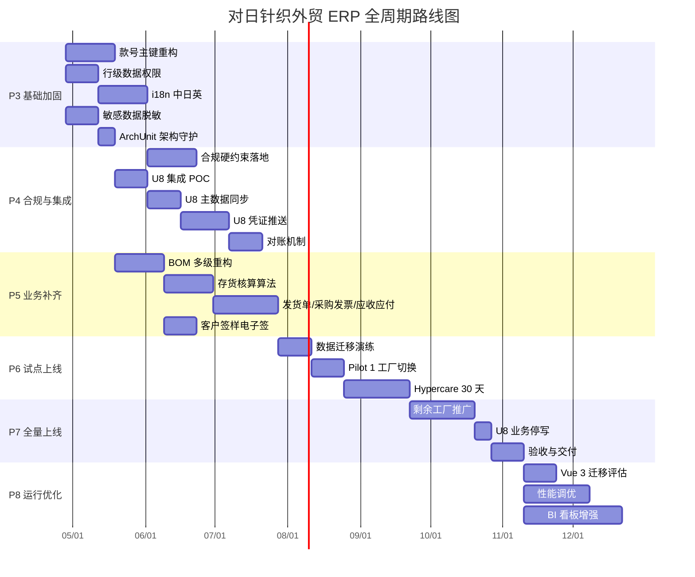
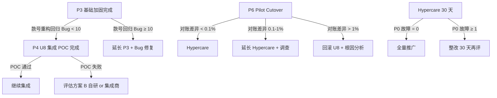

# 交付物 05：全周期 WBS + 风险预案

> **定位**：把前 4 份交付物的结论收敛为可执行的项目计划，建立项目"从当前状态到生产上线"的路径图与风险应对。
> **产出日**：2026-04-21 · **修订日**：2026-04-22 · **项目**：对日针织外贸 ERP
> **状态**：v1.1（同步 02 ADR-001 事实校正）
> **前置阅读**：`01-requirements`、`02-architecture`、`03-compliance`、`04-u8-migration`

---

## 0. 项目当前状态快照

【事实】基于探盘与前期文档：

| 维度 | 状态 |
| :-- | :-- |
| 核心开发（P0-P2） | 100% 完成（31 天投入，11 个 Domain + 43 测试 + 40 前端模块） |
| 前端模块总数 | 40 个（归一化后 37 个） |
| 后端 Controller | 40+ |
| 单元测试 | 43（前端 0） |
| Git 提交 | 最近 2 个月 7 次（频率低） |
| 部署文档 | 齐全（部署上线计划、运维手册、测试验收计划） |
| 前端测试 | 0 |
| i18n 日英文 | 未覆盖 |
| 款号主键统一 | 未完成 |
| 行级数据权限 | 未验证 |
| U8 集成 | 未启动 |
| 合规审计 | 基础审计有，敏感数据脱敏未 |

**简言之**：功能骨架已成形，但**生产上线的合规 / 集成 / 数据治理三大支柱仍需建设**。

---

## 1. WBS 分解（全项目周期）

### 1.1 阶段划分



**总工期估算**：约 **9 个月**（2026-04-28 → 2027-01-底）

### 1.2 P3 阶段：基础加固（8 周）

| 工作包 | 编号 | 工时（人日）| 前置 | 负责角色 | 交付物 |
| :-- | :-- | :-- | :-- | :-- | :-- |
| P3.1 款号字段命名统一 | P3.1 | 10 | - | 架构师 | PR + 回归测试 |
| P3.1.1 全局 grep + 重命名方案 | P3.1.1 | 2 | - | 架构师 | 重命名脚本 |
| P3.1.2 DDL 迁移 `style_no → style_code` | P3.1.2 | 2 | P3.1.1 | DBA | DDL 脚本 |
| P3.1.3 Domain/Mapper/XML 改造 | P3.1.3 | 3 | P3.1.2 | 后端 | PR |
| P3.1.4 前端 v-model 改造 | P3.1.4 | 2 | P3.1.3 | 前端 | PR |
| P3.1.5 回归测试 | P3.1.5 | 1 | P3.1.4 | QA | 测试报告 |
| **P3.2 款号双轨主键模型** | P3.2 | 15 | P3.1 | 架构师 | 表结构 + Domain |
| P3.2.1 `t_erp_style` 档案表 | P3.2.1 | 3 | - | 后端 | 表 + CRUD |
| P3.2.2 下游表补 `style_code_snapshot` | P3.2.2 | 5 | P3.2.1 | 后端 | PR |
| P3.2.3 款号生成器（Redis INCR） | P3.2.3 | 3 | - | 后端 | Generator + 单测 |
| P3.2.4 款号版本表 + 版本升级流程 | P3.2.4 | 4 | P3.2.1 | 后端 + Flowable | 流程定义 |
| **P3.3 行级数据权限** | P3.3 | 10 | - | 架构师 | 拦截器 + 测试 |
| P3.3.1 MyBatis DataScope 拦截器 | P3.3.1 | 5 | - | 后端 | 拦截器代码 |
| P3.3.2 `sys_user_factory` 关联表 | P3.3.2 | 1 | - | DBA | 表 + API |
| P3.3.3 注解 `@DataScope` 标注全业务 Mapper | P3.3.3 | 3 | P3.3.1 | 后端 | PR |
| P3.3.4 3 用户（总部 / 厂A / 厂B）隔离测试 | P3.3.4 | 1 | P3.3.3 | QA | 测试报告 |
| **P3.4 i18n 中日英** | P3.4 | 15 | - | 前端主导 | 多语言包 |
| P3.4.1 后端 i18n 配置 + 3 语言 messages | P3.4.1 | 3 | - | 后端 | 3 文件 |
| P3.4.2 前端 vue-i18n 集成 | P3.4.2 | 2 | - | 前端 | 封装 |
| P3.4.3 40 模块 UI 文案抽取 | P3.4.3 | 6 | P3.4.2 | 前端 | 3 语言 JSON |
| P3.4.4 主数据表日文字段补充 | P3.4.4 | 3 | - | DBA + 后端 | DDL + Domain |
| P3.4.5 日文业务数据回填 | P3.4.5 | 1 | P3.4.4 | 业务 | 数据录入 |
| **P3.5 敏感数据脱敏** | P3.5 | 8 | - | 后端 | 加密 + 脱敏 |
| P3.5.1 TypeHandler 加密（AES）| P3.5.1 | 3 | - | 后端 | 类 + KMS |
| P3.5.2 `@Sensitive` 注解 + Jackson Serializer | P3.5.2 | 3 | - | 后端 | 注解类 |
| P3.5.3 员工、联系人敏感字段改造 | P3.5.3 | 2 | P3.5.2 | 后端 | PR |
| **P3.6 ArchUnit 架构守护** | P3.6 | 5 | - | 架构师 | 守护测试 |
| P3.6.1 引入 ArchUnit 依赖 | P3.6.1 | 1 | - | 后端 | pom |
| P3.6.2 规则：依赖方向、包可见性 | P3.6.2 | 2 | - | 架构师 | 规则代码 |
| P3.6.3 违规修复 | P3.6.3 | 2 | P3.6.2 | 后端 | PR |

**P3 阶段汇总**：
- 工作包数：24 个
- 人日：63 人日
- 日历周：8 周（人日并行）
- 人员建议：2 后端 + 1 前端 + 1 架构师 + 1 QA

### 1.3 P4 阶段：合规与 U8 集成（10 周）

| 工作包 | 编号 | 工时 | 前置 | 交付物 |
| :-- | :-- | :-- | :-- | :-- |
| **P4.1 合规硬约束** | P4.1 | 25 | P3.5 | - |
| P4.1.1 `sys_data_export_log` 表 + AOP | P4.1.1 | 3 | - | 日志表 + 拦截 |
| P4.1.2 Flowable history=full + 审批证据表 | P4.1.2 | 3 | - | 配置 + 表 |
| P4.1.3 操作日志保留 6 月策略 | P4.1.3 | 2 | - | Quartz 任务 |
| P4.1.4 密码策略 + 失败锁定 | P4.1.4 | 3 | - | Spring Security 扩展 |
| P4.1.5 数据归档任务 | P4.1.5 | 4 | - | Quartz + 归档表 |
| P4.1.6 JIS 色牢度 + AQL 抽样 | P4.1.6 | 6 | - | 表 + 服务 |
| P4.1.7 RSL 批次追溯 | P4.1.7 | 4 | - | 表 + UI |
| **P4.2 U8 集成 POC** | P4.2 | 10 | - | 连通性 |
| P4.2.1 U8 环境调研 + 账套信息 | P4.2.1 | 2 | - | 调研报告 |
| P4.2.2 EAI 接口连通性验证 | P4.2.2 | 3 | P4.2.1 | POC 代码 |
| P4.2.3 字段映射表全量版 | P4.2.3 | 5 | P4.2.1 | 映射 Excel |
| **P4.3 U8 主数据同步** | P4.3 | 12 | P4.2 | - |
| P4.3.1 存货同步 | P4.3.1 | 3 | - | 定时任务 |
| P4.3.2 客户 / 供应商同步 | P4.3.2 | 3 | - | 定时任务 |
| P4.3.3 币种 / 汇率同步 | P4.3.3 | 2 | - | 定时任务 |
| P4.3.4 同步监控看板 | P4.3.4 | 4 | - | 前端 + 后端 |
| **P4.4 U8 凭证推送** | P4.4 | 18 | P4.3 | - |
| P4.4.1 销售凭证（发货 + 发票）| P4.4.1 | 4 | - | 服务 + 测试 |
| P4.4.2 采购凭证（入库 + 发票）| P4.4.2 | 4 | - | 服务 + 测试 |
| P4.4.3 库存凭证（领料 + 完工）| P4.4.3 | 4 | - | 服务 + 测试 |
| P4.4.4 工资凭证 | P4.4.4 | 2 | - | 服务 |
| P4.4.5 重试队列 + 失败告警 | P4.4.5 | 4 | - | Kafka + 告警 |
| **P4.5 对账机制** | P4.5 | 10 | P4.4 | - |
| P4.5.1 库存数量 / 金额对账 | P4.5.1 | 4 | - | 对账任务 |
| P4.5.2 销售额对账 | P4.5.2 | 3 | - | 对账任务 |
| P4.5.3 应收应付对账 | P4.5.3 | 3 | - | 对账任务 |

**P4 阶段汇总**：75 人日 / 10 周 / 建议人力 3 后端 + 1 DBA + 1 集成专家

### 1.4 P5 阶段：业务补齐（10 周）

| 工作包 | 编号 | 工时 | 交付物 |
| :-- | :-- | :-- | :-- |
| **P5.1 BOM 多级重构** | P5.1 | 15 | 支持纱/坯/成衣三级 |
| P5.1.1 BOM 表结构改造（递归）| P5.1.1 | 3 | DDL |
| P5.1.2 BOM 展开服务（多级计算用量）| P5.1.2 | 6 | 服务 + 单测 |
| P5.1.3 BOM 版本化 | P5.1.3 | 3 | 表 + 服务 |
| P5.1.4 前端 BOM 树形编辑器 | P5.1.4 | 3 | 组件 |
| **P5.2 存货核算算法** | P5.2 | 15 | 全月平均 + 计划成本 |
| P5.2.1 成本策略接口 | P5.2.1 | 2 | 接口 |
| P5.2.2 全月平均实现 | P5.2.2 | 5 | 服务 + 单测 |
| P5.2.3 计划成本实现 | P5.2.3 | 3 | 服务 + 单测 |
| P5.2.4 月结任务 + 快照表 | P5.2.4 | 5 | Quartz + 表 |
| **P5.3 三单核销（发货 / 发票 / 应收）** | P5.3 | 20 | 完整单据链 |
| P5.3.1 发货单模块（新增）| P5.3.1 | 5 | 模块 |
| P5.3.2 采购发票模块（新增）| P5.3.2 | 5 | 模块 |
| P5.3.3 应收应付模块 | P5.3.3 | 8 | 模块 |
| P5.3.4 三单核销逻辑 | P5.3.4 | 2 | 服务 |
| **P5.4 客户签样电子签** | P5.4 | 10 | 日方电签 |
| P5.4.1 e 签宝 SDK 集成 | P5.4.1 | 4 | 集成 |
| P5.4.2 客户外部登录（OAuth）| P5.4.2 | 3 | 认证扩展 |
| P5.4.3 签样 PDF 生成 + 签章 | P5.4.3 | 3 | 服务 |

**P5 汇总**：60 人日 / 10 周 / 建议 2 后端 + 1 前端 + 1 业务分析

### 1.5 P6 阶段：试点上线（8 周）

| 工作包 | 工时 | 交付物 |
| :-- | :-- | :-- |
| P6.1 数据迁移演练 | 10 | 演练报告（2 次）|
| P6.2 Pilot 工厂数据清洗 | 5 | 清洗后数据 |
| P6.3 Pilot Cutover Day | 1 | 切换日志 |
| P6.4 Hypercare Day 1-7 | 5（值守）| 日报 |
| P6.5 Hypercare Day 8-30 | 8（值守）| 周报 |
| P6.6 试点验收会 | 2 | 验收报告 |

### 1.6 P7 阶段：全量推广（7 周）

| 工作包 | 工时 | 交付物 |
| :-- | :-- | :-- |
| P7.1 剩余工厂分批切换 | 20 | 切换日志 |
| P7.2 全量 Hypercare | 10 | 全量周报 |
| P7.3 U8 业务停写 | 1 | 停写通告 |
| P7.4 验收签字 | 2 | 验收书 |

### 1.7 P8 阶段：持续优化（常态）

- Vue 3 迁移评估（试点 BI 模块）
- 性能调优（慢 SQL、缓存）
- BI 看板扩展（管理驾驶舱）
- 二期总账模块（评估后决定）

---

## 2. 里程碑与关键路径

### 2.1 关键里程碑

| MS | 日期（参考）| 验收标准 |
| :-- | :-- | :-- |
| **MS1** 基础加固完成 | 2026-06-22 | 款号统一、行级权限通过测试、i18n 上线 |
| **MS2** U8 集成就绪 | 2026-09-01 | POC 通过、主数据同步运行、7 类凭证推送稳定 |
| **MS3** 业务模块补齐 | 2026-11-10 | BOM 多级、存货核算、三单核销、电子签 完成 |
| **MS4** Pilot 切换成功 | 2026-12-01 | 对账差异 < 0.1%，Hypercare 无 P0 事故 |
| **MS5** 全量上线 | 2027-01-15 | 所有工厂切换，U8 业务停写 |
| **MS6** 项目验收 | 2027-02-01 | 验收书签字，进入运维期 |

### 2.2 关键路径分析

**关键路径**（最长依赖链）：
```
P3.1 款号统一 → P3.2 双轨主键 → P5.1 BOM 多级 → P5.2 存货核算 → P5.3 三单核销
→ P6.1 数据迁移演练 → P6.2-3 Pilot → P6.4-5 Hypercare → P7 全量 → 上线
```

**工期关键度**：18 周（4 个月）最短
**可缩短性**：P5.1-5.3 如果并行可再压缩 2-3 周
**风险点**：关键路径上任何延误都直接影响上线日期

### 2.3 可并行的非关键路径

- P3.3 行级数据权限（与 P3.1/P3.2 并行）
- P3.4 i18n（与 P3.5 并行）
- P4.1 合规硬约束（与 P4.2-4.5 U8 集成并行）
- P5.4 电子签（与 P5.1-5.3 并行）

---

## 3. 人力与预算估算

### 3.1 团队配置（建议）

| 角色 | 人数 | 阶段 | 全程人月 |
| :-- | :-- | :-- | :-- |
| 架构师 / 技术负责人 | 1 | 全程 | 9 |
| 后端高级 | 2 | P3-P7 | 14 |
| 后端中级 | 2 | P3-P7 | 14 |
| 前端 | 1.5 | P3-P7 | 10 |
| DBA | 0.5 | P3-P7 | 4 |
| 测试 / QA | 1 | P3-P8 | 8 |
| 业务分析 / PM | 1 | 全程 | 9 |
| 运维 | 0.5 | P6-P8 | 3 |
| 合规顾问（外聘）| 0.2 | P4 | 2 |
| **合计** | | | **73 人月** |

### 3.2 预算（参考）

| 项 | 金额（人民币）| 说明 |
| :-- | :-- | :-- |
| 人力成本（73 人月 × 2 万平均） | 146 万 | 按市场价 |
| 基础设施（云服务器 9 个月）| 5 万 | 阿里云 RDS + ECS + Redis |
| 软件许可（Flowable、Druid 等均免费）| 0 | OSS |
| 外部工具（阿里云 KMS、OSS、短信）| 2 万 | 按量 |
| 合规顾问 | 3 万 | 外聘 |
| e 签宝签章 | 2 万 | 按份 |
| U8 EAI 许可 | （U8 已付）| |
| 应急储备金（10%）| 15 万 | |
| **合计** | **173 万** | |

前期论证 ROI：首年收益 110 万。**加上本期投入后仍需 16 个月回收**。

---

## 4. 核心风险登记册（RAID）

### 4.1 业务风险

| ID | 风险 | 概率 | 影响 | 严重度 | 应对策略 |
| :-- | :-- | :-- | :-- | :-- | :-- |
| B01 | 需求变更频繁（客户要求 / 部门改口径）| 高 | 高 | 🔴 | 冻结基线 + 变更控制委员会（CCB）+ 每次评审影响 |
| B02 | 客户签样电子签日方不认可 | 中 | 高 | 🔴 | 提前与客户确认签章平台；准备纸签 fallback |
| B03 | 业务部门双系统并行期抗拒 | 高 | 中 | 🟡 | 充分培训 + 业务骨干试点 + Hypercare 值守 |
| B04 | 季节业务高峰撞车切换 | 中 | 高 | 🔴 | 切换窗口避开 2-3 月春夏大单、8-9 月秋冬大单 |
| B05 | 款号编码规则被业务拒绝 | 中 | 高 | 🔴 | §1.2 决策会议一次性拍板，预留版本迭代 |
| B06 | 日方客户突发新合规要求 | 中 | 中 | 🟡 | 设计预留扩展位；分级响应 |

### 4.2 技术风险

| ID | 风险 | 概率 | 影响 | 严重度 | 应对策略 |
| :-- | :-- | :-- | :-- | :-- | :-- |
| T01 | 款号重构触发大规模回归 Bug | 高 | 高 | 🔴 | 提前上 ArchUnit；全量单测；先灰度一个域 |
| T02 | 行级权限漏洞（跨工厂数据泄露）| 中 | 极高 | 🔴 | 3 用户对抗性测试；上线前第三方渗透测试 |
| T03 | Flowable 性能瓶颈（大量审批并发）| 低 | 中 | 🟡 | 压测 + 异步处理 + 数据分区 |
| T04 | U8 EAI 接口不稳定 / 版本不兼容 | 高 | 高 | 🔴 | POC 前置；保留直连 DB 备案；提前与用友支持沟通 |
| T05 | 存货核算算法与 U8 结果不一致 | 高 | 高 | 🔴 | 冷启对账（相同期初数）；差异 < 0.01% |
| T06 | 前端 Vue 2 安全漏洞（2023 后 EOL）| 中 | 中 | 🟡 | 监控 CVE；关键补丁手工打 |
| T07 | Redis 故障致款号生成阻塞 | 低 | 高 | 🟡 | 降级方案：回退 DB 查 MAX + 1 |
| T08 | 大数据量报表响应慢 | 中 | 中 | 🟡 | 报表走异步任务；引入预计算（物化视图）|
| T09 | 生产 DDL 变更破坏兼容 | 中 | 高 | 🔴 | 所有 DDL 走 Liquibase / Flyway；blue-green |
| T10 | 字符集 / 时区错（中日时差）| 中 | 中 | 🟡 | 所有时间字段 UTC 存储；显示层转换 |

### 4.3 合规风险

| ID | 风险 | 概率 | 影响 | 严重度 | 应对策略 |
| :-- | :-- | :-- | :-- | :-- | :-- |
| C01 | PIPL 标准合同未备案 | 中 | 极高 | 🔴 | 上线前法务确认；备案完成前限制出境数据 |
| C02 | 敏感数据泄露（身份证、银行卡）| 低 | 极高 | 🔴 | 加密 + 审计 + 定期渗透测试 |
| C03 | JIS / RSL 检测漏项 | 中 | 高 | 🔴 | 与品质部建立检测项矩阵；系统强制前置检查 |
| C04 | 客户验厂不通过 | 中 | 极高 | 🔴 | 按 §3 §5 预先准备证据包；每季度自查 |
| C05 | APPI 数据泄露通报滞后 | 低 | 极高 | 🔴 | 自动化告警 + 2 工作日内人工处置 SOP |
| C06 | 等保测评未通过 | 中 | 高 | 🔴 | 预评估 + 整改清单；提前 3 个月对接 |
| C07 | 海关 HS 编码错 | 中 | 中 | 🟡 | 物料入库必填 HS；月度抽样审核 |

### 4.4 交付风险

| ID | 风险 | 概率 | 影响 | 严重度 | 应对策略 |
| :-- | :-- | :-- | :-- | :-- | :-- |
| D01 | 人力不足（关键路径延期）| 高 | 高 | 🔴 | 备用外包资源；关键路径双人备份 |
| D02 | 关键人员流失 | 中 | 高 | 🔴 | 文档化 + Pair programming + 代码评审 |
| D03 | 测试覆盖不够（上线 Bug 激增）| 高 | 高 | 🔴 | 前端单测补齐（Vitest）；自动化 E2E |
| D04 | Pilot 对账差异超标 | 中 | 极高 | 🔴 | 不达标不切换；回滚方案到位 |
| D05 | 上线后运维知识断层 | 中 | 中 | 🟡 | 运维手册（已有）；培训 + Shadow 期 |
| D06 | 预算超支 | 中 | 中 | 🟡 | 10% 储备金；月度财务对齐 |

### 4.5 组织与依赖风险

| ID | 风险 | 应对 |
| :-- | :-- | :-- |
| O01 | 业务 Owner 决策缓慢 | 定 CCB 会议节律（每周）+ 超时升级 |
| O02 | 多部门协同效率低 | 设联络员制度；周会刚性 |
| O03 | 培训不到位导致误操作 | 上线前 3 天集中培训 + 操作手册 |
| O04 | U8 现场资源被占用 | 与财务排班；非业务高峰期做集成 |

---

## 5. 风险应对矩阵（4T 策略）

### 5.1 风险分级矩阵

```
             │   严重度：低      │   严重度：中      │   严重度：高
─────────────┼─────────────────┼─────────────────┼─────────────────
 概率：高    │  接受 Accept      │  减轻 Mitigate   │  规避 Avoid / 减轻
 概率：中    │  接受 Accept      │  减轻 Mitigate   │  减轻 / 转移 Transfer
 概率：低    │  接受 Accept      │  接受 / 减轻      │  减轻 / 转移 / 应急储备
```

### 5.2 重点风险的具体应对

| 风险 | 策略 | 具体动作 | 触发预案 |
| :-- | :-- | :-- | :-- |
| B04 季节高峰撞车 | **规避 Avoid** | 切换窗口锁定 11-12 月低峰 | 若延期到 1 月，推到 6 月 |
| T04 U8 接口不稳 | **减轻 + 转移** | POC 前置；签用友技术支持合同 | 若 POC 不通过，考虑场景 B（自研）或找集成商 |
| C04 验厂不通过 | **减轻 + 转移** | 提前模拟验厂；购买合规咨询 | 若验厂失败，30 天内整改 |
| T02 数据泄露 | **减轻 + 转移** | 上线前第三方渗透测试；购买信息安全险 | 一旦发生：按 APPI 2 工作日通报流程 |
| D01 人力不足 | **减轻** | 关键路径双人；备用外包 | 延期 > 2 周时启动外包 |

---

## 6. 止损条件与决策树

### 6.1 项目级止损条件

**红线**（触发任一即进入项目级评审）：

1. 实际工期超计划 30% 以上（如 9 个月变 12 个月）
2. 预算超 20% 以上（如 173 万变 207 万）
3. Pilot 对账差异持续 > 1%（超过 2 周无法收敛）
4. 连续 2 次验厂不通过
5. 核心人员流失 > 30%

**决策动作**：

- 暂停全量推广
- 向公司决策层汇报现状与建议（继续 / 调整范围 / 终止）
- 启动方案调整（缩小范围 / 分阶段交付 / 外部支援）

### 6.2 关键决策节点



---

## 7. 质量门禁（Quality Gates）

每阶段结束设置硬门禁，不达标不进入下一阶段：

### 7.1 P3 → P4 门禁

- [ ] 款号重构 PR 合并 + 回归测试通过率 100%
- [ ] 行级权限 3 用户测试通过
- [ ] i18n 中日英主要页面 > 90% 覆盖
- [ ] 敏感字段加密 + 脱敏单测通过
- [ ] ArchUnit 架构规则 0 违规

### 7.2 P4 → P5 门禁

- [ ] U8 主数据同步连续运行 7 天无故障
- [ ] 7 类凭证推送单笔 + 批量测试通过
- [ ] 对账任务每日运行 + 差异收敛

### 7.3 P5 → P6 门禁

- [ ] BOM 多级展开单测 100%
- [ ] 存货核算结果与 U8 比对差异 < 0.1%
- [ ] 发货 / 发票 / 应收单据链 E2E 测试通过
- [ ] 客户签样电子签流程 UAT 通过

### 7.4 P6 → P7 门禁

- [ ] Pilot 工厂运行 30 天
- [ ] 对账差异 < 0.1%（库存、销售、应收）
- [ ] 无 P0 事故（停机 > 30 分钟）
- [ ] 用户满意度调研 ≥ 80%

### 7.5 P7 → 验收门禁

- [ ] 全部工厂切换完成
- [ ] U8 业务停写 30 天
- [ ] 月度对账差异稳定 < 0.01%
- [ ] 合规审计（内部）通过
- [ ] 验收测试用例 100% 通过

---

## 8. 治理机制

### 8.1 会议节律

| 会议 | 频率 | 参与 | 产出 |
| :-- | :-- | :-- | :-- |
| 日站会 | 每日 | 技术团队 | 任务/阻塞 |
| 周迭代评审 | 每周五 | 全员 | 燃尽图、周报 |
| 双周业务对齐 | 每 2 周 | 业务 + 技术 | 需求变更决策 |
| 月度指导委员会 | 每月 | 高管 + PM + 架构师 | 风险升级、预算对齐 |
| 阶段门禁评审 | 每阶段末 | 全员 + 利益相关方 | Go/No-Go |

### 8.2 变更控制委员会（CCB）

**组成**：业务 Owner、技术负责人、QA 负责人、财务代表

**变更流程**：
1. 变更提案人提交 CR（Change Request），含范围、工时、风险
2. CCB 每周会评审（紧急变更 48h 内线上决策）
3. 决议：批准 / 拒绝 / 延后
4. 批准后更新 WBS + 风险册

### 8.3 沟通矩阵

| 信息 | 对象 | 渠道 | 频率 |
| :-- | :-- | :-- | :-- |
| 周报 | 所有相关方 | 邮件 + 企微 | 每周五 |
| 燃尽图 | 技术团队 | Jira / 看板 | 实时 |
| 风险登记册 | PM + 架构师 | Confluence | 双周更新 |
| 阶段报告 | 决策层 | 线下评审会 | 阶段末 |
| 生产事故 | 全员 | 企微告警 + 事故群 | 实时 |

---

## 9. 资源清单（从本文输出到执行）

### 9.1 立即启动的行动（本周）

- [ ] 与业务 Owner 开会消解 `01 §9 遗留问题` 中的 7 条 P0
- [ ] 与财务开会确认 `04 §0` 的 A1-A6 假设
- [ ] 与 IT 安全开会确认 `03 §10` 的合规 P0
- [ ] 组建团队（架构 + 后端 + 前端 + QA）
- [ ] 搭建 Jira / Confluence / 代码仓库等协作工具

### 9.2 本月产出

- [ ] 完整 WBS 导入 Jira（本文 §1 为蓝本）
- [ ] 风险登记册导入 Confluence（本文 §4 为蓝本）
- [ ] 首轮 Sprint 规划（2 周 Sprint，9 月前交付 P3）

### 9.3 未来 6 个月产出

- MS1（2026-06-22）：基础加固完成
- MS2（2026-09-01）：U8 集成就绪
- MS3（2026-11-10）：业务模块补齐

---

## 10. 遗留问题

| ID | 问题 | 默认决策 | 紧迫度 |
| :-- | :-- | :-- | :-- |
| WR-001 | 是否接受 9 个月的工期 | 作为基准方案 | 🔴 P0 |
| WR-002 | 预算 173 万能否落实 | 需决策层批 | 🔴 P0 |
| WR-003 | 团队 8 人能否招到 | 部分外包 | 🔴 P0 |
| WR-004 | Pilot 工厂选择哪一个 | 业务量中等、领导配合度高的 | 🟡 P1 |
| WR-005 | 是否接受场景 A（U8 保留做账）| 推荐 | 🔴 P0 |
| WR-006 | 切换窗口锁定 11-12 月 | 避开季节高峰 | 🟡 P1 |
| WR-007 | 需要外聘合规顾问吗 | 推荐（2 人月）| 🟡 P1 |

---

**关联交付物**：`01-requirements` · `02-architecture` · `03-compliance` · `04-u8-migration` · `99-assumptions`
**本文档字数**：约 5600 字 | **mermaid 图**：2 张 | **表格**：27 张 | **工作包**：70+ | **风险条目**：40+

---

## 变更日志

- **2026-04-22 v1.1**：同步 02 ADR-001 事实校正。§1.2 WBS 表 P4.1.4 备注"Shiro 扩展" → "Spring Security 扩展"。
  工时(3 人日)、前置依赖不变。
