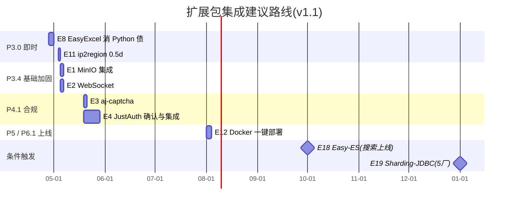

# 08 · 若依官方扩展包 · 备选增强目录(P3-P5 候选清单)

> **定位**:对 2026-04-22 下载于 `D:/下载/ruoyi/`(22 包)与 `D:/下载/ruoyi-vue/`(10 包)的若依官方集成扩展包逐一解压分析,作为 **P3 基础加固 / P4 合规与集成 / P5 业务补齐** 阶段的可选增强库。去重、合并变体后共 **24 个独立能力点**(E1-E24)。
> **产出日**:2026-04-22 · **项目**:对日针织外贸 ERP(基于 RuoYi-Vue 3.9.2 + Spring Boot 4.0.3)
> **读者**:架构师、PM、技术负责人
> **性质**:**评估目录,不含承诺**。每项需走独立决策(EnterPlanMode)后再实施。
> **版本**:v1.1(覆盖全量 24 包)

---

## 0. 跨包共性约束(重要)

### 0.1 Spring Boot 4.x 迁移税

**所有包均为 Spring Boot 2.x 时代产物**,本项目 Spring Boot **4.0.3** 已迁至 Jakarta EE 9+:

| 旧包名 | 新包名 | 影响 |
| :-- | :-- | :-- |
| `javax.servlet.*` | `jakarta.servlet.*` | 控制器/过滤器必改 |
| `javax.persistence.*` | `jakarta.persistence.*` | Entity 注解必改 |
| `javax.validation.*` | `jakarta.validation.*` | `@NotNull` 等必改 |
| `javax.annotation.Resource` | `jakarta.annotation.Resource` | 依赖注入必改 |
| `javax.websocket.*` | `jakarta.websocket.*` | WebSocket 注解必改 |

**每包集成工作量需加 0.5-1 人日迁移税**(grep + 批量替换 + 编译校验)。

### 0.2 前端 RuoYi 版本差异

扩展包前端源自 **RuoYi-Vue 3.8.8**,本项目 **3.9.2**。关键差异:
- 本项目 `axios 0.30.3`,扩展包 `0.28.1` — 向后兼容
- 本项目 `jsencrypt 3.0.0-rc.1`,扩展包同版本 — 一致
- 本项目无 `crypto-js`,扩展包用到时需新增依赖

### 0.3 Shiro vs Spring Security 鉴权差异

部分包来自 `D:/下载/ruoyi/` 即 **RuoYi 非 Vue 版**,该版本用 **Shiro**;本项目按 ADR-001 v1.1 走 **Spring Security + JWT**。以下包强依赖 Shiro,**不可直接集成**:

| 包 | Shiro 入侵点 | 替代方案 |
| :-- | :-- | :-- |
| `jwt-shiro` (E7) | ShiroConfig + UserRealm + JwtFilter | 本项目已有 Spring Security 版 JWT |
| `cas` (E10) | ShiroConfig + CasRealm + pac4j 整合 | 用 `spring-security-cas` 或直接 JustAuth |
| `redis 集群会话` (E17) | Shiro Session 集群方案 | 本项目 Redis 已用于 JWT,不需要 Shiro Session |
| `atomikos` (E9) | 部分引用 Shiro | 见 E9 条目 |

### 0.4 禁改 `ruoyi-framework` 约束

CLAUDE.md 规定:**禁止修改 `ruoyi-framework/` 框架核心代码**。以下包默认落在 framework 下,需改造落位:

| 包 | 原位置 | 建议落位 |
| :-- | :-- | :-- |
| WebSocket (E2) | `ruoyi-framework/websocket/` | `ruoyi-admin/websocket/` |
| Atomikos (E9) | `ruoyi-framework/config/*Config.java` | ❌ 不集成 |
| Sharding-JDBC (E19) | `ruoyi-framework/config/ShardingDataSourceConfig.java` | 触发条件达成后再评估 |

---

## 1. 扩展包全量总览矩阵(E1-E24)

### 1.1 强推荐 ⭐⭐⭐(直接对应已决策或即时可用)

| ID | 包 | 来源 | 文件 | 关键依赖 | 适配 | 对齐点 | 阶段 |
| :-- | :-- | :-- | :-: | :-- | :-: | :-- | :-- |
| E1 | `minio` 分布式文件存储 | `ruoyi/` | 3 | `io.minio:minio-sdk` | 2d | 02 AR-005 | P3.4 |
| E2 | `websocket` 实时通信 | `ruoyi-vue/` | 5 | spring-boot-starter-websocket | 1.5d | P8 BI 看板 | P3 末 / P8 |
| E8 | `easyexcel` Excel 增强 | `ruoyi/` | 6 | `com.alibaba:easyexcel` | 2d | **BOM/订单导入,P3 即用** | P3.0 即时 |
| E11 | `ip2region` 离线地理定位 | `ruoyi/` | 4 | `org.lionsoul:ip2region` | 0.5d | 登录日志地理字段 | P3.4 |

### 1.2 推荐 ⭐⭐(匹配路线图,时机到再动)

| ID | 包 | 来源 | 文件 | 关键依赖 | 适配 | 对齐点 | 阶段 |
| :-- | :-- | :-- | :-: | :-- | :-: | :-- | :-- |
| E3 | `aj-captcha` 滑块验证码 | `ruoyi-vue/` | 11 | `anji-plus:captcha-boot-starter` | 2d | 03 §6 防暴破 | P4.1 |
| E4 | `JustAuth` 第三方 SSO | `ruoyi-vue/` | 19 | `me.zhyd.oauth:JustAuth` | 5-7d | 03 §7 日方 SSO | P4.1(先确认需求)|
| E12 | `docker` 一键部署(Vue)| `ruoyi-vue/` | 7 | — | 3d | **P6.1 Pilot 直接用** | P5/P6.1 |

### 1.3 条件触发 ⏸(等条件满足)

| ID | 包 | 来源 | 文件 | 关键依赖 | 适配 | 对齐点 | 触发 |
| :-- | :-- | :-- | :-: | :-- | :-: | :-- | :-- |
| E18 | `easy-es` ES 全文检索 | `ruoyi-vue/` | 8 | `easy-es-boot-starter` + ES 7.x | 3d | BI/检索需求 | 单表 > 500 万或搜索页面上线 |
| E19 | `sharding-jdbc` 分库分表 | `ruoyi/` | 11 | `shardingsphere-jdbc` | 8-12d | 02 ADR-002 | 5+ 工厂 / 单表 > 1000 万 |

### 1.4 可选 ⭐(价值有限)

| ID | 包 | 来源 | 文件 | 关键依赖 | 适配 | 对齐点 | 建议 |
| :-- | :-- | :-- | :-: | :-- | :-: | :-- | :-- |
| E5 | `jsencrypt` 密码加密传输 | `ruoyi/` | 5 | jsencrypt(已装) | 2d | HTTPS 双层 | HTTPS 后补层 |
| E13 | `ai` 智能模型对话 | `ruoyi-vue/` | 14 | `dev.langchain4j:langchain4j-open-ai` | 5d | — 无路线图对应 | 日方需 AI 能力时启用 |
| E20 | `ueditor` 富文本 | `ruoyi/` | 276 | Baidu UEditor | 不建议 | 前端已有 Quill | **用现有 Quill** |
| E21 | `elfinder` 在线文件管理 | `ruoyi/` | 369 | ruoyi-elfinder 独立模块 | 4d | 与 MinIO 重叠 | 选 MinIO 即可 |

### 1.5 不推荐 🔴(与现有决策冲突)

| ID | 包 | 来源 | 文件 | 冲突点 |
| :-- | :-- | :-- | :-: | :-- |
| E6 | `druid 密码加密` | `ruoyi/` | 2 | 与 `4372f289` 外化方案重叠 |
| E7 | `jwt(Shiro 版)` | `ruoyi/` | 8 | ADR-001 v1.1 Spring Security + JWT |
| E9 | `atomikos` 分布式事务 | `ruoyi/` | 6 | 02 ADR-007 不引 Seata/Atomikos |
| E10 | `cas` 单点登录 | `ruoyi/` | 6 | Shiro + pac4j;JustAuth 更轻 |
| E14 | `docker 含 redis`(ruoyi/ 版) | `ruoyi/` | 5 | 前端缺失,选 E12 Vue 版 |
| E15 | `docker` 简版(ruoyi/)| `ruoyi/` | 3 | 同上 |
| E16 | `mybatisplus` MyBatis 增强 | `ruoyi/` | 12 | 与 PageHelper 冲突,官方要求"先删 MyBatisConfig" |
| E17 | `redis 集群会话` | `ruoyi/` | 15 | Shiro Session 方案,本项目不用 |
| E22 | `ehcache` 本地缓存切换 | `ruoyi-vue/` | 16 | 替换 Redis,阻断多节点会话 |
| E23 | `ehcache3` 本地缓存切换 | `ruoyi-vue/` | 15 | 同上 |
| E24 | `使用 postgresql 数据库版本` | `ruoyi-vue/` | 24 | 当前 MySQL 5.7 路线不切 |
| — | `升级 Spring Boot 到最新 3.x` | `ruoyi-vue/` | 312 | **本项目已 4.0.3,此包反而倒退** |

---

## 2. 推荐与重要类条目详情(E1-E12 关键项)

### E1 · MinIO 分布式文件存储 ⭐⭐⭐

**文件(3)**:`MinioConfig.java`(`@ConfigurationProperties(prefix="minio")`)、`MinioUtil.java`、`FileUploadUtils.java`(覆盖式修改)

**依赖**:`io.minio:minio:8.5+`

**对齐**:02 ADR AR-005(大文件 MinIO/OSS 二选一)

**冲突**:`FileUploadUtils.java` 是 ruoyi-common 共享类,不能直接覆盖,改造为双实现(本地 / MinIO)

**建议**:P3.4 样品图/色卡落地时一并做

---

### E2 · WebSocket 实时通信 ⭐⭐⭐

**文件(5)**:`WebSocketConfig`、`WebSocketServer`、`WebSocketUsers`、`SemaphoreUtils` + `websocket.vue` 示例

**依赖**:`spring-boot-starter-websocket`

**冲突**:零(新文件)。**但默认落在 `ruoyi-framework/websocket/`,需改落位到 `ruoyi-admin/websocket/`** 以守 CLAUDE.md 约束

**建议**:生产看板实时推送 + 排单冲突即时提示,P3 末小迭代

---

### E3 · aj-captcha 滑块验证码 ⭐⭐

**文件(11)**:后端 SPI 1 个、前端 Verifition 组件 7 个 + login.vue/api/login.js/package.json

**依赖**:`com.anji-plus:captcha-spring-boot-starter:1.3.0+`;前端 `crypto-js 4.1.1`

**冲突**:`login.vue` 已被我们改过(i18n + 主题引擎),需 merge 不能覆盖

**建议**:与 P4.1 密码策略一次性做

---

### E4 · JustAuth 第三方 SSO ⭐⭐(5-7 人日最重)

**文件(19)**:后端 7 + 前端 11 + SQL 1

**依赖**:`me.zhyd.oauth:JustAuth:1.16.6+`

**冲突**:⚠️⚠️⚠️ 高 — `SysUserServiceImpl` / `login.vue` / `request.js` / `permission.js` 都有本项目改造

**建议**:**先确认日方是否需 SSO 与协议类型**(OAuth2 / SAML / LINE / Yahoo Japan),如确定 OAuth2 可考虑用 `spring-security-oauth2-client` 替代

---

### E8 · EasyExcel Excel 增强 ⭐⭐⭐(P3 即时)

**文件(6)**:修改 `ExcelUtil.java`(ruoyi-common 共享工具)、`SysOperlogController.java`、新增 3 个 Converter + 修改 `SysOperLog` Domain

**依赖**:`com.alibaba:easyexcel:3.3.2+`

**对齐**:
- BOM 导入 / 订单导入 / 物料导入 — 本项目已有多个 Python 临时脚本(`import_bom.py`、`import_salesorder.py`),替换为规范化 EasyExcel 可消除技术债
- POI 4.1.2 → EasyExcel 内存占用降 10x,百万级不 OOM

**冲突**:⚠️ `ExcelUtil.java` 共享类,merge 而非覆盖。SysOperLog 修改需合并字段

**建议**:**P3.0 即时启动**,先做 BOM 导入流水线规范化,消 Python 脚本技术债。**预计 2-3 人日完整迁移**

---

### E11 · ip2region 离线地理定位 ⭐⭐⭐

**文件(4)**:`AddressUtils.java`、`RegionUtil.java`、`ip2region.db`(离线数据库 ~10MB)、pom 更新

**依赖**:`org.lionsoul:ip2region:2.7.0+`

**对齐**:
- `登录日志` 表的 `login_location` 字段当前空置或靠外部接口
- 03 合规:登录异常需记录地理位置但**不可调公网 API**(PIPL 数据出境顾虑)

**冲突**:零(新增工具类),替换现有 `AddressUtils.java` 一行调用

**建议**:**P3.4 敏感数据脱敏** 窗口顺手做,**0.5 人日**

---

### E12 · Docker 一键部署(Vue 版) ⭐⭐

**文件(7)**:`docker-compose.yml` + 4 个 Dockerfile(mysql/nginx/redis/ruoyi)+ `nginx.conf` + `redis.conf`

**依赖**:Docker 20.10+ + docker-compose

**对齐**:
- 与 docs/07 Pilot 核对清单 §C 中间件组强关联
- 可自动化 Pilot 工厂部署(免人工装 JDK/MySQL/Redis)
- 解决 `其他/` 下 Nginx 1.8.1 / Redis 3.2.100 过老问题(Docker 镜像版本可控)

**冲突**:
- `application.yml` / `application-druid.yml` 需改为读环境变量(已做 ✅ commit `4372f289`)
- 与 docs/07 §4 环境变量清单天然契合

**建议**:**P5 末 / P6.1 Pilot 部署前** 启用,让 Pilot 运维只需 `docker-compose up -d`

---

## 3. 条件触发类详解(E18-E19)

### E18 · Easy-ES 分布式全文检索 ⏸

**文件(8)**:`EsTextDocument` model、`TextSearchController`、EsTextDocumentMapper、Search / SearchImpl、notice 页改造

**依赖**:`cn.easy-es:easy-es-boot-starter:2.x`、**Elasticsearch 7.x**(`其他/` 下有 `elasticsearch-7.14.0.zip`,版本匹配)

**触发**:
- 单表 > 500 万(订单 / 物料)
- 上线"全局搜索"功能

**适配**:3 人日(ES 运维 + 索引设计 + 数据同步)

### E19 · Sharding-JDBC 分库分表 ⏸

**文件(11)**:`ShardingDataSourceConfig`、`SysOrder` 示例 Domain / Mapper / Service / XML + table.sql + 修改 DruidConfig

**依赖**:`org.apache.shardingsphere:shardingsphere-jdbc-core:5.x`

**触发**(02 ADR-002):
- 工厂数 ≥ 5
- 单表 > 1000 万
- 单工厂日订单 > 500

**适配**:8-12 人日(分片规则设计 + 数据迁移 + 事务边界重审)

---

## 4. 决策矩阵(给业务/技术负责人)· 覆盖全 24 包

| # | 决策点 | 建议 | 依据 |
| :-- | :-- | :-- | :-- |
| D1 | MinIO (E1) 纳入 P3.4? | ✅ 是 | 02 ADR AR-005 |
| D2 | WebSocket (E2) 放 admin/websocket? | ✅ 是 | CLAUDE.md 禁改 framework |
| D3 | **EasyExcel (E8) P3.0 即时启动?** | ✅ **强推,消 Python 技术债** | 现状多个 import_*.py 已成维护负担 |
| D4 | **ip2region (E11) P3.4 顺手做?** | ✅ **0.5 人日,性价比极高** | 合规 + 登录日志完整性 |
| D5 | Docker (E12) P6.1 前启用? | ✅ 是 | 绕开 Pilot 环境不统一风险 |
| D6 | aj-captcha (E3) P4.1 时机? | ✅ 是 | 与密码策略一次改造 |
| D7 | JustAuth (E4) 要不要? | ⏸ 先问日方 | 协议未定前别做 5-7 人日 |
| D8 | AI 对话 (E13) 要不要? | ⏸ 日方需求浮现前搁置 | 无路线图对应 |
| D9 | UEditor (E20) / elfinder (E21)? | ❌ 否 | Quill 已满足 / MinIO 重叠 |
| D10 | ehcache (E22/E23) / MyBatis-Plus (E16) / PG (E24)? | ❌ 全否 | 架构偏离 |
| D11 | **"升级 Spring Boot 3.x" 用不用?** | ❌ **绝对不** | **本项目已 4.0.3,集成此包 = 倒退** |

---

## 5. 阶段性集成建议路线(v1.1 更新)



---

## 6. 归档与清理

| 已解压包 | 位置 | 处置 |
| :-- | :-- | :-- |
| 24 个扩展包 + 重复变体 | `D:/下载/ruoyi-extracted/`(28 个目录) | 会话临时目录,**不入 git**;集成完成后可删,未采纳的归档至 `D:/erp/vendor/ruoyi-official-extensions-20260422/` |
| zip 原包 | `D:/下载/ruoyi/` + `D:/下载/ruoyi-vue/` | 建议整体 tar 备份 |

**归档命令范例**:
```bash
# 会话结束后:
tar -czf D:/erp/vendor-ruoyi-extensions-20260422.tar.gz -C "D:/下载" ruoyi ruoyi-vue
# 将 tar 包存档,原解压目录可清理
```

---

## 7. 相关文档引用

| 主题 | 本文位置 | 主文档 |
| :-- | :-- | :-- |
| ADR-001 鉴权栈 | §0.3 / E7 / E10 / E17 | `02 ADR-001 v1.1` |
| MinIO / OSS 选型 | E1 | `02 ADR AR-005` |
| 禁改 framework 约束 | §0.4 / E2 | `CLAUDE.md` |
| 日方 SSO | E4 | `03 §7` |
| 外化 vs 加密 | E6 | commit `4372f289`、`03 §1.1.2` |
| Spring Boot 4.x 迁移 | §0.1 | `06 §3.1` |
| Pilot 环境基础设施 | E12 / E17 | `07 §3`、`09 整文` |
| 若依平台数据库表 | — | `09 §3`(人工审阅项) |

---

## 变更日志

- **2026-04-22 v1.1**:覆盖全量 24 个扩展包(E1-E24),从 v1.0 的 7 包扩展至全量。
  新增 E8 EasyExcel(⭐⭐⭐ P3.0 即时,消 Python 脚本技术债)、E11 ip2region(⭐⭐⭐ 0.5 人日高性价比)、E12 Docker(⭐⭐ Pilot 部署)作为强推项;
  扩展不推荐类 (E14-E24 + 升级 SB3.x) 的明确判断理由;
  决策矩阵从 6 条扩至 11 条。
- **2026-04-22 v1.0**:初版,7 包分析。
